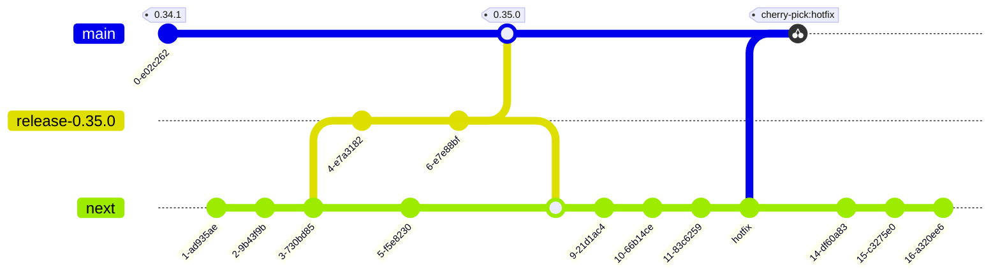

# Releasing galasa.dev

The following websites are updated as a result of pushing changes to the `main` and `next` branches:

- [galasa.dev](https://galasa.dev/) (`main` branch)
- [vnext.galasa.dev](https://vnext.galasa.dev/) (`next` branch)

**TODO:** confirm what other artifacts are produced and when, if any.

## Before releasing

Create a new `release-x.y.z` branch to create the release.

Make the required documentation updates for the new release, for example:

- search for and update the version number, including in the `src/pages/index.js` file
- add a summary of changes to `src/markdown-pages/highlights.md`

## Create release

Create a pull request to merge the release branch to `main`. The [galasa.dev](https://galasa.dev/) should publish automatically.

## After releasing

Create a pull request to merge the release branch to `next`. The [vnext.galasa.dev](https://vnext.galasa.dev/) should publish automatically.

## Git branching strategy

**TODO:** describe the following diagram and why it is the way it is!

**Warning:** this is a slight change to the current process and will require the PR bot to be disabled!

