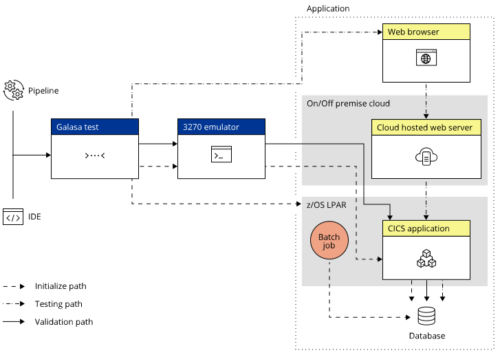

Galasa, [an Open Mainframe Project](https://openmainframeproject.org/projects/galasa/){target="_blank"}, is different from other test tools; enabling deep integration testing across platforms and technologies within a DevOps pipeline, Galasa supports repeatable, reliable, agile testing at scale across your enterprise.

### Platform integration
The Galasa framework is built with a knowledge of z/OS and cloud native platforms, enabling end-to-end testing of applications that run on different platforms without stubbing or mocking. 

### Technology integration
Galasa is fully extensible. Galasa Managers enable Galasa to interact with any test technology, such as JMeter, Selenium, JCL, and 3270 screens and more. 

### Pipeline integration
Galasa provides a REST endpoint that can be called from any CI/CD pipeline, for example, a Jenkins pipeline. Running Galasa as part of your pipeline enables fast, reliable testing at scale - Galasa can run thousands of tests in parallel. 

### Enterprise integration
Galasa is not simply about providing the ability to write a test and run it in automation.  Galasa's test catalog enables you to understand and manage your tests, making it easy to schedule the right tests to run at the right time. Test results and artifacts are stored in a single repository, making reporting and problem determination simple when combined with native Kibana and Grafana dashboards. 

Galasa is open-source, so there’s no vendor lock-in; it can be integrated into an existing pipeline and work with third-party tooling. 

## Using Galasa in a hybrid cloud environment

Using hybrid cloud, enterprises can host applications and data on the platforms that deliver the best combination of efficiency, security, and performance. However, a mix of platforms and technologies makes end-to-end integration testing complicated.

Galasa simplifies testing in such an environment. The following diagram shows an example of how you can use Galasa to test a hybrid cloud application:  

This sophisticated solution requires end-to-end integration testing of an application that runs on different platforms (z/OS and Cloud) and uses different technologies (a 3270 emulator, JCL batch job and Selenium Web Driver). 

When run inside a [Galasa Ecosystem](../docs/ecosystem/index.md), a Galasa test can be invoked from an IDE or as part of a CI/CD pipeline. The Galasa framework initializes the test environment, creates valid test data, runs the test and validates the test output. As all test results and artifacts are stored in one location, it's easy to generate reports and diagnose the cause of any failures.

## Use Galasa to help you to: 

-	simplify the construction of new integration tests and incorporate them easily into future regression test suites
-	quickly validate your applications against new releases of middleware or operating system updates
-	deliver new functions to applications fast and with confidence to delight your users 
-	easily verify system functionality post maintenance
