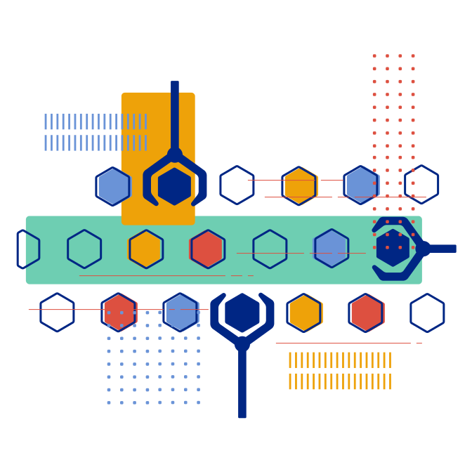
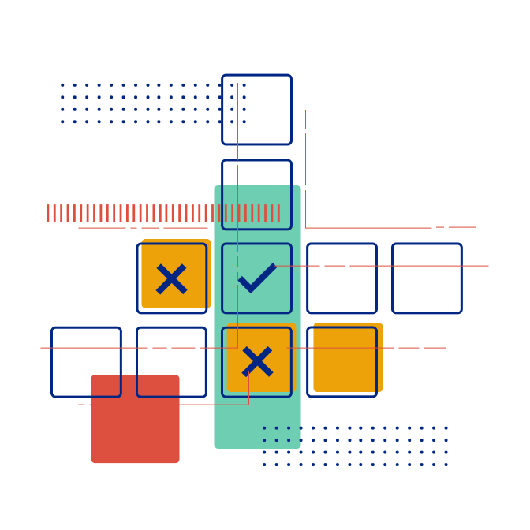
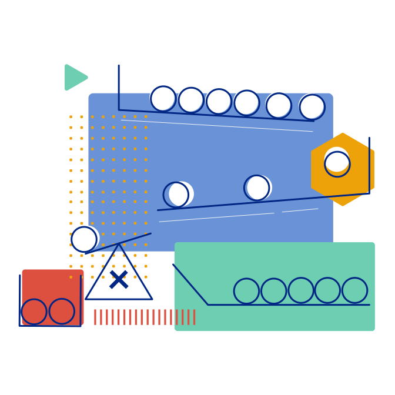
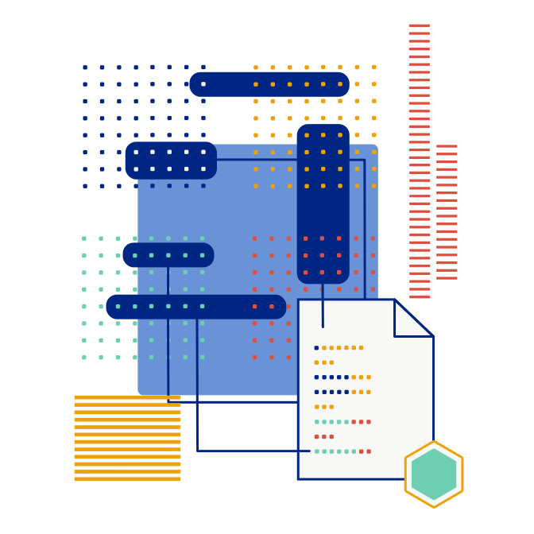

# Deep integration testing for z/OS powered hybrid cloud applications

Allowing you to test applications at scale regardless of platform — including z/OS.

[Get started](./docs/index.md){ .md-button .md-button--primary }
[Learn more](./about/index.md){ .md-button }
[0.xx.0 highlights](./releases/index.md){ .md-button }

-   __Consistent testing – for all technologies__

    ---

    You can write Galasa tests as a JUnit-style Java class and run them locally from your IDE or in automation without having to change a single line of code. Deep z/OS integration means you can verify data by interrogating the CICS application directly and gives you the ability to check other z/OS resources, such as messages on queues, without using stubs or mocking.

    

-   __Focus on the test – not the integration problems__

    ---

    Galasa’s framework enables deep integration tests to be run across multiple technologies. One test case can interact with 3270, Selenium, JMeter, batch jobs and more. When you’re ready, Galasa integrates easily into your [DevOps strategy](about/devops.md), and can be used alongside other test tools.

    

-   __Get the test data you need – fast__

    ---

    Galasa can integrate with your test data strategy by helping you to provision new or existing test data records. Galasa can also lock test data so that many tests can run in parallel against the same test data pool, making it easy to repeat tests under identical conditions for swift debugging. Provisioned environments are automatically deprovisioned at test completion, leaving a clean test system state ready for the next tests.

    

-   __See the big picture – from one location__

    ---

    Test results and artifacts are stored in a single location in a uniform style, enabling easy extraction of big picture information. A single place to search all test output makes it easy to quickly identify the cause of a failure and run tests locally to assist with debugging.

    

-   __Test planning and recording – made easy__

    ---

    The ability to create a test catalog within Galasa means that you can easily define areas under test, enabling automation of even the most arduous manual tests and making it easy to record and plan what tests have run and what is left to do.

    

-   __Keep on growing – Galasa grows with you__

    ---

    Galasa is open source, so can be extended to support additional tooling with no vendor lock-in and no initial cost. The framework supports enterprise level throughput, as the test workload can be scaled horizontally in its own cloud environment.

    

