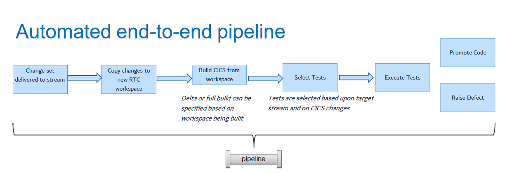

## What is DevOps?
DevOps is a set of processes that enable development and operations teams work together to deliver and run software in a repeatable, fast and error-free way. 

### Benefits of Galasa as part of a DevOps strategy 
DevOps provides significant benefit in three key areas:

1.	Faster time to value

    Galasa provides the ability to automate integration tests in a repeatable and reliable way, enabling fast and efficient software delivery.

2.	Increased capacity to innovate

    Running your integration tests by using Galasa automation instead of running them manually saves time, freeing up people to work on higher-value activities.

3.	Enhanced customer experience
    
    Galasa enables continuous testing, so you can get early feedback from stakeholders about the software that’s being delivered.

### DevOps principles and Galasa
The three key principles of DevOps are:

 - Develop and test against production-like systems
    
    Galasa supports the DevOps concept "shift left", in which operational concerns move earlier in the delivery life cycle, toward development. Galasa enables teams to test against systems that behave like the production system, so that they can see how the application behaves and performs well before it’s ready for deployment.

    From an operations perspective this capability has tremendous value. It enables the operations team to see early in the cycle how their environment will behave when it supports the application, thereby allowing them to create a fine-tuned, application-aware environment.

 - Deploy with repeatable, reliable processes
 
    Galasa enables development and operations to support an agile (or at least iterative) software development process all the way through to production by using automation to run tests that are iterative, frequent, repeatable, and reliable.
    
    Frequent deployments and early testing allow teams to test the deployment processes themselves, thereby lowering the risk of deployment failures at release time.

 - Monitor and validate operational quality

    When software is tested, Galasa stores the test artifacts in a single repository, making it quicker and easier to analyse and identify the cause of a failure. Test results are captured in a consistent format, making sign-off between test environments simple and consistent.

## DevOps concepts 

### Continuous integration

Continuous integration is a practice in which software developers continuously or frequently integrate their work with that of other members of the development team and then test the integrated work. In the case of complex systems made up of multiple systems or services, developers also regularly integrate their work with other systems and services. Regular integration of results leads to early discovery and exposure of integration risks. In complex systems, it also exposes known and unknown risks — both technical and schedule-related.

Continuous integration adds tremendous value in DevOps by allowing large teams of developers, working on cross-technology components in multiple locations, to deliver software in an agile manner. It also ensures that each team’s work is continuously integrated with that of other development teams and then validated. Continuous integration thereby reduces risk and identifies issues earlier in the software development life cycle.

### Continuous delivery

Continuous integration naturally leads to the practice of continuous delivery: the process of automating the deployment of the software to the testing, system testing, staging, and production environments. Although some organizations stop short of production, those that adopt DevOps generally use the same automated process in all environments to improve efficiency and reduce the risk introduced by inconsistent processes.

In test environments, automating configuration, refreshing test data, and then deploying the software to the test environment followed by the execution of automated tests speeds up the feedback cycles of test results to development.

### Continuous testing

Continuous integration has several goals:
 - Enabling ongoing testing and verification of code
 - Validating that the code produced and integrated with that of other developers and other components of the application functions and performs as designed
 - Continuously testing the application being developed

Continuous testing means testing earlier and continuously across the life cycle, which results in reduced costs, shortened testing cycles, and achieved continuous feedback on quality. This process is also known as "shift-left" testing, which stresses integrating development and testing activities to ensure quality is built in as early in the life cycle as possible and not something left to later. This is facilitated by adopting capabilities like automated testing and service virtualization. Service virtualization is the capability for simulation of production-like environments and makes continuous testing feasible.

From a process perspective, you need to adopt processes in three areas to enable continuous testing: 
 - Test environment provisioning and configuration
 - Test data management -  For any organization that wants to enable continuous testing, managing test data is an essential function. The number of tests that can be run and the frequency with which they’re run are limited by the amount of data that’s available for testing and the speed at which that data can be refreshed.
 - Test integration -  tests and associated results can be stored and traceability established back to the code

### Continuous deployment 

Continuous release and deployment take the concept of continuous integration to the next step. The practice that enables release and deploy also enables the creation of a *delivery pipeline*. This pipeline facilitates continuous deployment of software to QA and then to production in an efficient, automated manner. The goal of continuous release and deployment is to release new features to customers and users as soon as possible.

### Delivery pipeline
A delivery pipeline consists of the stages an application goes through from development through to production. Figure  3-1 shows a typical set of stages. These stages may vary from one organization to another, however, and may also vary from one application to another based on the organization’s needs, software delivery process, and maturity. The level of automation may also vary. Some organizations fully automate their delivery pipelines; others put their software through manual checks and gates due to regulatory or company requirements. You don’t have to address all stages at once. Start by focusing on the critical parts of organization — not everything all at once — and then gradually broaden to include all stages.

## How Galasa fits into a delivery pipeline

Galasa's primary focus is on the continuous testing part of the pipeline, and specifically around the provision of scalable test automation for integration testing. 

Galasa supports environment provisioning and configuration, including automatic clean-up of environments, as well as a test data management capability. Test output is automatically recorded and stored in a central repository or locally on a laptop, making it quicker and easier to diagnose the cause of a failure.

Galasa supports a "shift left" approach to testing, enabling tests to run simultaneously across different environments. These test suites can be triggered to run whenever a change set is delivered. When an application is created or updated, the code must successfully run through a relevant suite of Galasa tests before it can move along the delivery pipeline. If the code passes all the tests, you can have confidence that the production deployment will be successful. The following image illustrates how the automated end-to-end pipeline process could be used for CICS applications:

A continuous delivery pipeline can be used to execute a set of Galasa tests in parallel with a single API call.  The pipeline can then inquire on the state of the executing tests and once all are completed decide how to progress to the next stage of the pipeline.

