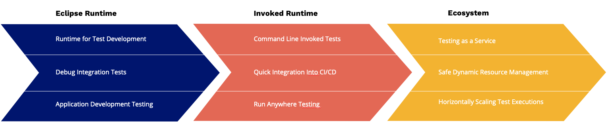

# Running Galasa from a CLI - Invoked Runtimes

The aim of this blog is to provide some context of how galasa tests can be run manually from the CLI, without an IDE or Ecosystem. This is can be used as a great opportunity to demonstrate running galasa tests in automation. However for full Testing as a service, with horizontal scaling and resource safe testing check out a Galasa ecosystem.

#### Blog Contents
1. [Why use the Invoked Runtime](#why-use-the-invoked-runtime)
2. [Concepts of running outside Eclipse](#concepts-of-running-outside-an-ide)
3. [How to setup test projects](#how-to-setup-a-test-project)
4. [Running from the CLI](#running-a-test-from-the-CLI)
5. [Next Steps](#next-steps)

## Why use the invoked runtime

You may have been exploring the capabilities of Galasa using Simbank within an Eclipse IDE, and starting to think about the next steps of how to incorporate a Galasa test as part of your automation, or even just testing phases. The full solution lies within the Galasa ecosystem which provides a complete enterprise solution for Testing as a service, but to get started quickly for proof of concepts, the invoked runtimes can be used to run tests within automation and CI/CD pipelines.



If the overhead of setting up an ecosystem doesn't match your timescales for a proof of concept or your usecase, you can use the invoked runtime as a stepping stone to move you into the right direction. So what does an invoked runtime offer?
- The ability to execute a test class outside of an IDE.
- To run tests off a workstation and on a dedicated server.
- First steps into automation and test artifact management.

## Concepts of running outside an IDE

Galasa utilizes a special type of JVM to execute tests inside of, called an OSGi container. This is done so we can dynamically load java artifacts into the runtime as and when they are required, including different Galasa extensions, Galasa managers, and jars containing test materials and dependencies. Even so this runtime is essentially executed with a `java -jar ...` style command

The eclipse plugin provided from the Galasa project abstracts a lot of this work away from the user to make execution easier. When running a test (after it has been compiled) eclipse does:
1. A obr (OSGi Bundle Repository) is quickly built containing all the java projects in your workspace
1. Starts an OSGi runtime called Felix which loads all of the Galasa components and any requested compiled tests within the workspace. It locates the requested java bundles within any given OBR's from a local maven repository and maven central (or another repository passed in the galasa configurations).
1. Executes the test with the output going to the Console in Eclipse, storing all output locally

When requesting a test to be run, typically 2 OBR's are passed, the uber obr which lists all the galasa components, and a test obr which describes the tests we are looking to run and any dependencies. This second OBR is the workspace obr built at the start of a test run within Eclipse. The Galasa framework is not limited to 2 OBR's, as some more complex setups can contain custom managers which don't make sense to house in the same code base as tests, but this blog will keep things simple.

This usually means that once we are looking to start running Galasa tests outside of Eclipse (either within a Ecosystem or Invoked Runtime) we need to consider creating our own OBR build to describe what we are trying to run and its dependencies. Another concept to consider is where test material will be fetched from. Unlike in the eclipse environment we don't want to be compiling code each time we want execute a test. This means we want to to both build and deploy our test code into an artifact repository:


Automating this into a pipeline often saves a lot of work going forward, especially if there is going to be a team of people contributing tests. Once we host out compile test bundles and OBR's inside an artifact repository like Artifactory or Nexus, we can retrieve them at runtime without any need to compile code:


_\*Currently the pull from a test engine only supports pulling via anonymous access._

However, this step is only required if you have different server/environment for your build pipeline and your Galasa invoked runtime. If you are compiling and running on the same server you can make use of the fact a `mvn install` will place all of the compiled maven artifacts in the local maven repository (`~/.m2/repository`) and skip the deploy. If you are planning to use a Galasa ecosystem however, this approach would not work, as each test case is run inside an isolated container and will require to pull the artifacts from a maven repository.


## How to setup a test project
There is a lot of options when it comes to project structure to enable running galasa, so in this blog I will show the most standard setup for someone getting started. 

The basic concept is that we need to have our compiled test material stored in an artifact repository (whether local or remote) which is then described within an OBR. Both the Jar containing the tests and the OBR are then passed to the galasa boot jar for execution.

The quickest way to get this setup is to include an OBR build into the compile stages of your test material builds. We can do this by setting up a structure that looks like this:

```
Maven Project with child modules:
[-]-> com.example.galasa.tests.parent
    [-]-> com.example.galasa.test.bundle1
        |-> TestClass1
        |-> TestClass2
        |-> TestClass3
        |-> pom.xml (TestClass Pom)
    [+]-> com.example.galasa.test.bundle2
    [+]-> com.example.galasa.test.bundle3
    [+]-> com.example.galasa.test.bundle4
    [-]-> com.example.galasa.test.obr
        |-> pom.xml (Obr Pom)
    |-> pom.xml (Parent Pom)
```
Here we have a parent project that contains 4 test bundles, each of which could contain multiple test classes.
We then have a obr module in my parent projects whose only job is to create a OBR that describes the test bundles in the project. 
We can use the parent pom.xml to store all of our build mechanisms for the project and have every child project inherit them. For example the parent pom might look like this:
```
<project
    xmlns="http://maven.apache.org/POM/4.0.0"
    xmlns:xsi="http://www.w3.org/2001/XMLSchema-instance" xsi:schemaLocation="http://maven.apache.org/POM/4.0.0 https://maven.apache.org/xsd/maven-4.0.0.xsd">
    <modelVersion>4.0.0</modelVersion>

    <groupId>com.example</groupId>
    <artifactId>com.example.galasa.tests.parent</artifactId>
    <version>0.1.0</version>
    <packaging>pom</packaging>

    <modules>
        <module>com.example.galasa.test.bundle1</module>
        <module>com.example.galasa.test.bundle2</module>
        <module>com.example.galasa.test.bundle3</module>
        <module>com.example.galasa.test.bundle4</module>
        <module>com.example.galasa.test.obr</module>
    </modules>

    <dependencyManagement>
        <dependencies>
            <dependency>
                <groupId>dev.galasa</groupId>
                <artifactId>galasa-bom</artifactId>
                <version>0.22.0</version>
                <type>pom</type>
                <scope>import</scope>
            </dependency>
        </dependencies>
    </dependencyManagement>

    <dependencies>
        <dependency>
            <groupId>dev.galasa</groupId>
            <artifactId>dev.galasa</artifactId>
            <scope>provided</scope>
        </dependency>
        <dependency>
            <groupId>dev.galasa</groupId>
            <artifactId>dev.galasa.framework</artifactId>
            <scope>provided</scope>
        </dependency>
        <dependency>
            <groupId>dev.galasa</groupId>
            <artifactId>dev.galasa.zos.manager</artifactId>
            <scope>provided</scope>
        </dependency>
        <dependency>
            <groupId>dev.galasa</groupId>
            <artifactId>dev.galasa.zos3270.manager</artifactId>
            <scope>provided</scope>
        </dependency>
        <dependency>
            <groupId>org.assertj</groupId>
            <artifactId>assertj-core</artifactId>
            <scope>provided</scope>
        </dependency>
    </dependencies>

    <build>
        <pluginManagement>
            <plugins>
                <plugin>
                    <groupId>org.apache.felix</groupId>
                    <artifactId>maven-bundle-plugin</artifactId>
                    <version>5.1.1</version>
                </plugin>
                <plugin>
                    <groupId>org.apache.maven.plugins</groupId>
                    <artifactId>maven-plugin-plugin</artifactId>
                    <version>3.6.0</version>
                </plugin>
                <plugin>
                    <groupId>dev.galasa</groupId>
                    <artifactId>galasa-maven-plugin</artifactId>
                    <version>0.20.0</version>
                </plugin>
                <plugin>
                    <groupId>org.eclipse.m2e</groupId>
                    <artifactId>lifecycle-mapping</artifactId>
                    <version>1.0.0</version>
                    <configuration>
                        <lifecycleMappingMetadata>
                            <pluginExecutions>
                                <pluginExecution>
                                    <pluginExecutionFilter>
                                        <groupId>org.apache.felix</groupId>
                                        <artifactId>maven-bundle-plugin</artifactId>
                                        <versionRange>[5.1.1,)</versionRange>
                                        <goals>
                                            <goal>bundle</goal>
                                        </goals>
                                    </pluginExecutionFilter>
                                    <action>
                                        <execute>
                                            <runOnConfiguration>true</runOnConfiguration>
                                            <runOnIncremental>true</runOnIncremental>
                                        </execute>
                                    </action>
                                </pluginExecution>
                            </pluginExecutions>
                        </lifecycleMappingMetadata>
                    </configuration>
                </plugin>
            </plugins>
        </pluginManagement>
        <plugins>
            <plugin>
                <groupId>org.apache.felix</groupId>
                <artifactId>maven-bundle-plugin</artifactId>
                <extensions>true</extensions>
            </plugin>
            <plugin>
                <groupId>dev.galasa</groupId>
                <artifactId>galasa-maven-plugin</artifactId>
                <extensions>true</extensions>
                <executions>
                    <execution>
                        <id>build-testcatalog</id>
                        <phase>package</phase>
                        <goals>
                            <goal>bundletestcat</goal>
                        </goals>
                    </execution>
                </executions>
            </plugin>
        </plugins>
    </build>
</project>
```
With most of the dependencies and build definitions placed in the parent pom, the individual poms for the test bundles and obr are relatively simple. For example, a test bundle:
```
<project
    xmlns="http://maven.apache.org/POM/4.0.0"
    xmlns:xsi="http://www.w3.org/2001/XMLSchema-instance" xsi:schemaLocation="http://maven.apache.org/POM/4.0.0 https://maven.apache.org/xsd/maven-4.0.0.xsd">
    <modelVersion>4.0.0</modelVersion>
    <parent>
        <groupId>dev.galasa</groupId>
        <artifactId>com.example.galasa.tests.parent</artifactId>
        <version>0.1.0</version>
    </parent>
    <artifactId>com.example.galasa.test.bundle1</artifactId>
    <packaging>bundle</packaging>
</project>
```
Which only defines its packaging type as `bundle` and that it is a child module of the parent project. 

For the OBR to be generated that contains our test bundles we need to setup the obr module as so:
```
<project
    xmlns="http://maven.apache.org/POM/4.0.0"
    xmlns:xsi="http://www.w3.org/2001/XMLSchema-instance" xsi:schemaLocation="http://maven.apache.org/POM/4.0.0 https://maven.apache.org/xsd/maven-4.0.0.xsd">
    <modelVersion>4.0.0</modelVersion>
    <parent>
        <groupId>com.example/groupId>
        <artifactId>com.example.galasa.tests.parent</artifactId>
        <version0.1.0</version>
    </parent>
    <artifactId>com.example.galasa.test.obr</artifactId>
    <packaging>galasa-obr</packaging>
    <dependencies>
        <dependency>
            <groupId>com.example</groupId>
            <artifactId>com.example.galasa.test.bundle1</artifactId>
            <version0.1.0</version>
        </dependency>
        <dependency>
            <groupId>com.example</groupId>
            <artifactId>com.example.galasa.test.bundle2</artifactId>
            <version0.1.0</version>
        </dependency>
        <dependency>
            <groupId>com.example</groupId>
            <artifactId>com.example.galasa.test.bundle3</artifactId>
            <version0.1.0</version>
        </dependency>
        <dependency>
            <groupId>com.example</groupId>
            <artifactId>com.example.galasa.test.bundle4</artifactId>
            <version0.1.0</version>
        </dependency>
    </dependencies>
</project>
```
The important things to note are the packaging type is set to galasa-obr, and all of the the test bundles we wish to include into this OBR are also expressed as dependencies. This should also be true of any other test dependencies, otherwise at runtime there will be unsatisfied requirement errors.

Please note that as of version 0.22.0 it is only possible to generate the OBR using maven. There are ongoing items for adding this capability to both the gradle plugin ([here](https://github.com/galasa-dev/projectmanagement/issues/1000)) as well as the galasactl ([here](https://github.com/galasa-dev/projectmanagement/issues/1001)). It is also possible to generate an OBR this way without the need to compile using maven. A standalone project without the parent will pull (from either local or remote) maven artifacts to create the OBR, so this could also be a solution for some users.

Once the project is configured correctly, a `mvn clean install` will both build the jars/obr and install them into your local maven repository (`~/.m2/repository`). Having the artifacts deployed their (or in a remote maven repository) makes it easier to manage versions and downloads of test material and OBR's when actually running a test.

## Running a test from the CLI
Firstly we need to download the boot.jar, which can be located on maven central:
```
# Main page for boot jar versions
https://mvnrepository.com/artifact/dev.galasa/galasa-boot

# Direct download for version 0.21.0
https://repo1.maven.org/maven2/dev/galasa/galasa-boot/0.21.0/galasa-boot-0.21.0.jar
```
_\*Note that even though the latest version of Galasa might be 0.22.0, components are only versioned up if changed. So at the time of writing, the boot.jar was at 0.21.0._

If you have experimented with the Simbank examples you will already know how important the configurations are to the test we wish to execute. The standard locations that Galasa will look for these configurations is `~/.galasa/*.properties` from the user executing the run command. So if you are moving from a local run onto a server, remember to move/update these properties to ensure you are passing any configurations (cps.properties)

To run the boot jar we can use a standard `java -jar ....` style command:
```
java -jar boot.jar \
--localmaven file:/Users/jamesdavies/.m2/repository/ \
--remotemaven https://repo.maven.apache.org/maven2/ \ 
--bootstrap file:///Users/jamesdavies/.galasa/bootstrap.properties \
--overrides file:///Users/jamesdavies/.galasa/overrides.properties \
--obr mvn:dev.galasa/dev.galasa.uber.obr/0.22.0/obr \
--obr mvn:com.example/com.example.galasa.test.obr/0.1.0/obr \
--test com.example.galasa.test.bundle1/com.example.galasa.test.bundle1.TestClass1
```
- `--localmaven`, `--remotemaven`,`--overrides`,`--bootstrap` are all set to the default values.
- `--obr mvn:dev.galasa/dev.galasa.uber.obr/0.22.0/obr` - expresses to use the version 0.22.0 galasa components (using maven artifacts)
- `--obr mvn:com.example/com.example.galasa.test.obr/0.1.0/obr` - passes our tests to be loaded into the OSGi container
- `--test com.example.galasa.test.bundle1/com.example.galasa.test.bundle1.TestClass1` states which test class to run.

Running this jar with these arguments starts up the galasa framework and executes the test passed.

Once a test is completed, you may still need to retrieve all of the output, whether this is the run log, or any of the stored artifacts saved during execution. In Eclipse it may not be clear, but all of the results are saved to a local directory in `~/.galasa/ras/*`, and this is the same location that any invoked run will save results.

## Next Steps

With the understanding of how to run a galasa test from the CLI, it is possible to have any CI/CD executor perform this action too. 

A step that I would encourage is to now look to automate the build and deploy of test artifacts and OBR's to a non local maven repository. Having a simple automated way to rebuild and redeploy test material helps organize and manager tests going forward. 

Having test artifacts deployed is also a necessary step when looking to use a galasa ecosystem, as well as making integration onto a CI/CD simpler. There is no need to have any test code locally, just the access to the repo to pull at runtime.

There is some future work in discussion to look to include these steps into the galasactl command, making it even simpler to run from a local command line. If this is something you think you would benefit from, please come talk to us on our [github repo](https://github.com/galasa-dev/projectmanagement) or on our [slack](https://galasa.slack.com/)

---
Author: James Davies - IBM
Date: 17th May 2022

---