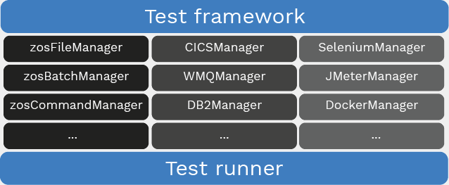

This hub page contains links to the main Galasa documentation. To get started with Galasa as quickly as possible, choose *Getting Started* from the menu on the left. Otherwise you can read on to familiarise yourself with Galasa's broad architecture and choose from the left hand menu to understand some of the soft principles surrounding the creation of successful tests and test suites.

#Galasa's architecture
At the topmost level, Galasa decomposes into three major components:

* The underlying Galasa core framework
* A set of managers 
* A test runner

*Galasa's key components*

##The core framework
Galasa's core framework orchestrates all component activities, and together with the test runner, is the component that actually executes your tests. This means that you never have to write code to invoke your tests - you just write the code that defines them, as a set of one or more test classes and the methods within. The framework recognises when your tests are correctly annotated and written and launches the required managers and the test runner to provision and execute them.

The framework has been designed to make it extremely straightforward for testers to become productive and start writing tests as soon as possible. Most of the complexity is offloaded to managers, which while more involved, only have to be written once and can be put to use across your team as soon as they are ready. Galasa's native extensibility owes a lot to this partitioning of responsibilities between the core framework and the managers it uses - it is possible (and indeed expected) that you might wish to write your own managers that provide organization-specific features.

It is extremely unlikely that you would need to change the framework or test runner code during the normal range of testing activities. 

##Managers
Managers contain the provisioning code that sets up and tears down the environments in which your tests run. Sometimes, they can perform a range of general purpose services, at others they are much more focused. For example, the HTTPClientManager contains a wide range of facilities you might expect from a programmable HTTP client, while the DB2Manager confines its scope to a range of DB2 interactions. 

Most managers you encounter will be one of three types:

* *Core managers*: a set of central, fundamental managers with wide-ranging use. Examples include *zosFileManager*, *zosBatchManager* and *zosCommandManager*. These are part of the core Galasa distribution.
* *Product managers*: a set of managers responsible for test interactions with specific products, for example *CICSManager*, *WMQManager* and *DB2Manager*. Again, some product managers will be part of the core Galasa distribution but it is also possible that your team may write its own manager for a specialty product used in your organization.
* *Other, or ancillary managers*: a set of managers to orchestrate the integration of a range of useful software tools and components, such as *SeleniumManager*, *JMeterManager* and *DockerManager*. It is likely that you will write your own managers to expose the services of similar tools and components used within your team.

###Application-specific managers
As well as consuming the services of managers either delivered with Galasa or written by others, you are likely to need to write a manager specific to your application under test. This is to abstract *application-specific* boilerplate functionality into a single place, removed from the tests themselves. 

You can read more about managers [here](/docs/reference/managers).

##The test runner
Under the direction of the core framework, the Galasa test runner is responible for actually executing your tests.