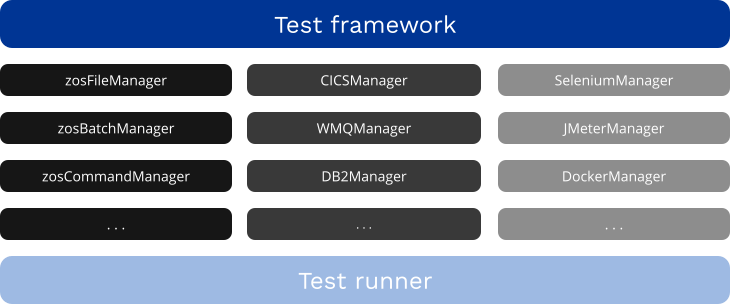

 
To get going with Galasa as quickly as possible, explore the [Getting started using the Galasa CLI](/docs) section. Read on to learn a little about Galasa's architecture and key components.

# Galasa's architecture
At its top level, Galasa decomposes into three major components:

* The underlying core Galasa framework
* A collection of Managers 
* A test runner

*Galasa's key components (not all Managers are currently implemented)*

## The core framework
Galasa's core framework orchestrates all component activities, and co-ordinates with the test runner to actually execute your tests. You never have to write code to *invoke* your tests - you just write the code that defines them, as a set of one or more test classes and the methods within. 

The Galasa framework automatically recognizes your test definitions, and launches the required Managers and the test runner to provision and execute them. All without you having to explicitly invoke them.

It is unlikely that you will need to change the framework or test runner code during the normal range of testing activities. 

For more information about the benefits of using a framework for your automated testing, see the [Benefits of Galasa](../about/automation) section.

## Managers
The two main purposes of a Manager are to reduce the amount of boilerplate code within a test and provide proven tool interaction code. This makes the test code simpler and easier to write, understand and maintain, as the focus of a test's development shifts to validating application changes, rather than marshalling environmental resources.

Sometimes, Managers perform a range of general-purpose services, and at other times, they are much more focused. For example, the HTTPClientManager contains a wide range of facilities you might expect from a programmable HTTP client, while the DB2Manager confines its scope to a range of DB2 interactions.

Different Managers can collaborate with each other to perform a joint task, including sharing information and getting other Managers to complete tasks for them. This work is coordinated by the Galasa framework.

Three types of Manager are delivered with Galasa:

* *Core Managers*: a set of central, fundamental Managers with wide-ranging use. Examples include *zosFileManager*, *zosBatchManager* and *zosCommandManager*. These are part of the core Galasa distribution.
* *Product Managers*: a set of Managers responsible for test interactions with specific products, for example *CICSManager*, *WMQManager* and *DB2Manager*. Again, some product Managers will be part of the core Galasa distribution but it is also possible that your team may write its own Manager for a specialty product used in your organization.
* *Other, or ancillary Managers*: a set of Managers to orchestrate the integration of a range of useful software tools and components, such as *SeleniumManager*, *JMeterManager* and *DockerManager*. It is likely that you will write your own Managers to expose the services of similar tools and components used within your team.

### Application-specific Managers
As well as consuming the services of Managers either delivered with Galasa or written by others, you may need to write a Manager specific to your application under test - an *application-specific Manager*. This is to abstract *application-specific* boilerplate functionality into a single place, removed from the tests themselves. 

A [summary table describing Managers](/docs/managers) that are currently available or planned for future releases is available in the Managers topic.

## The test runner
Under the direction of the core framework, the Galasa test runner is responsible for actually executing your tests.