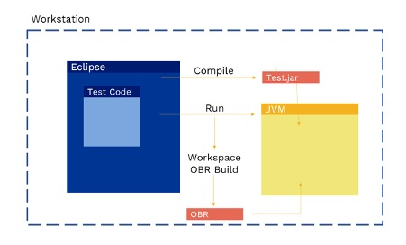
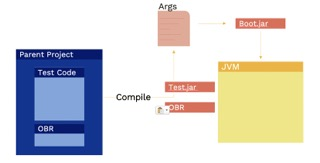

Galasa SimBank shows how you can run a Galasa test locally inside an IDE. Running a test inside an IDE enables test and application develop teams to run tests in a local workspace that interacts with real resources - ideal for minimising the risk of regressions from code changes.  
  
After writing a test to run locally on your machine, start to realise the power of Galasa by running that test in automation inside the [Galasa Ecosystem](ecosystem.md).

To run a test in automation inside the Galasa Ecosystem, you need to complete the following high-level tasks: 
  
1. Convert a local test into an OSGi bundle-wrapped project 
2. Deploy the test artifacts to a Maven repository 
3. Set up a new test stream 
4. Run the test headlessly as part of a pipeline 

Use this documentation to guide you through the process. After completing the following steps, you will have successfully run a test in automation. 
 

### Running a test inside an IDE

Compiling and running a test locally in Eclipse automatically creates a test jar file and an OSGi Bundle Repository (OBR) which enables Galasa to run any artifacts that are contained within the workspace. 
  
The following diagram shows how a Galasa test that is created within Eclipse enables you to run the test and interact with resoruces inside your IDE. Both the test code and the JVM running the test are on your workstation.  Galasa tests are compiled into a JAR and this JAR is provided to the Galasa runtime which then runs the tests.  
 
When you create your run and run configuration within Eclipse, a workspace OBR build is initiated. The OBR build creates an OSGI bundle repository that represents what is in the workspace, including any tests. The OBR and the compiled test JAR are passed to an OSGI environment in which the tests are run. All of this is contained within your IDE.  

### Running a test outside of an IDE

Structuring tests so that they can be run outside of an IDE means that the tests can be accessed by authorized team members and can be run anywhere.  
 
You can structure tests to be run outside of an IDE by creating a parent project in Eclipse, and adding test code and an OBR as modules to sit within that parent project.
 

The parent project describes the test project, its dependencies and the OBR required to run the test.  
 
When the parent project is compiled, a test jar and OBR object are generated and these artifacts can be deployed on a Maven repository.  

### Next steps

Use the example in the [Running a test in automation](/docs/ecosystem/automating) documentation to guide you through the process of setting up a test that can be run in automation outside of an IDE. 

questions on slack --- 

To be able to bring in external dependancies into the project/manager, they need to be included within an OBR, so the osgi runtime knows to go and retrieve them before trying to execute. At the current moment (this was something raised and we are working on) when we look to run a test we build an workspace OBR that gets passed to the test at runtime. when we build the workspace OBR, your manager isnt included in the workspace OBR, as its nor currently there. One choice is to load the manager project into the same workspace as the test project so that the workspace OBR picks up your manager. Any dependeniceis you add need to be osgi bundles. both of those are not OSGi bundles, easy to convert them though have a look at the wrapping repo in the galasa-dev org.  Basically we created a new pom.xml file that has a dependency on the OS module.  we then use a plugin to create the new manifest for the bundle.  Build that pom and you should produce an OSGi compliant version of the code.

 
 