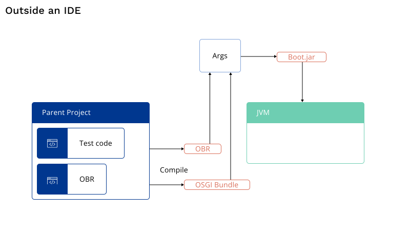

Galasa SimBank shows how you can run a Galasa test locally inside an IDE. Running a test inside an IDE enables test and application development teams to run tests in a local workspace that interacts with real resources - ideal for building a test quickly.

After writing a test to run locally on your machine, start to realise the power of Galasa by running that test in automation inside the Galasa Ecosystem.

To run a test in automation inside the Galasa Ecosystem, you need to complete the following high-level tasks:

1. Structuring a test to run in automation. You can do this by setting up a Galasa project either [inside](running-automation) or <a href="/docs/writing-own-tests/setting-up-galasa-project">outside</a> of Eclipse.
2. [Deploy the test artifacts to a Maven repository](deploying-to-maven)
3. [Set up a new test stream](/docs/writing-own-tests/test-streams)
4. Initiate the test from either Eclipse or from the [galasactl command line tool](/docs/cli-command-reference/cli-command-reference)

Use this documentation to guide you through the process.

### Running a test inside an IDE
Compiling and running a test locally in Eclipse automatically creates an OSGi Bundle and an OSGi Bundle Repository (OBR) which enables Galasa to run any artifacts that are contained within the workspace.

The following diagram shows how a Galasa test that is created within Eclipse enables you to run the test and interact with resources inside your IDE. Both the test code and the JVM running the test are on your workstation.  Galasa tests are compiled into a OSGi Bundle and this OSGi Bundle is provided to the Galasa runtime which then runs the tests.

When you create your run and run configuration within Eclipse, a workspace OBR build is initiated. The OBR build creates an OSGi bundle repository that represents what is in the workspace, including any tests. The OBR and the compiled test OSGi Bundle are passed to an OSGi environment in which the tests are run. All of this is contained within your IDE.  

  

### Running a test outside of an IDE
Structuring tests so that they can be run outside of an IDE means that the tests can be accessed by authorized team members and can be run anywhere.
You can structure tests to be run outside of an IDE by creating a parent project, and adding test code and an OBR as modules to sit within that parent project.  

  

The parent project describes the test project, its dependencies and the OBR required to run the test. When the parent project is compiled, an OSGi Bundle and OBR object are generated and these artifacts can be deployed on a Maven repository.

### Next steps
Go through the <a href="/docs/writing-own-tests/setting-up-galasa-project">Setting up a Galasa project</a> documentation to understand more about any requirements and a high level overview of the structure of a parent project.

Use the example in the [Setting up a Galasa project outside of Eclipse](running-automation) documentation to guide you through the process of setting up a parent project without using Eclipse.
Use the example in the <a href="/docs/ecosystem/automating/running-automation">Setting up a Galasa project by using Eclipse</a> documentation to guide you through the process of setting up a parent project by using Eclipse.

