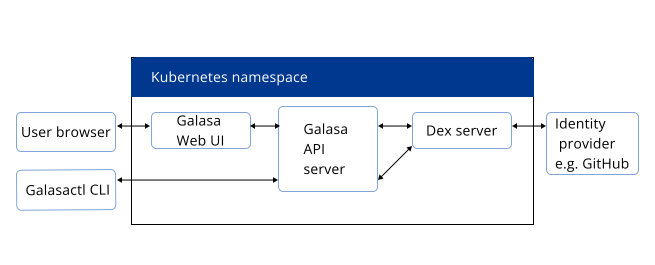

Before interacting with a Galasa Ecosystem using the Galasa command line tool (galasactl), you must be authenticated with it. Galasa uses personal access tokens to authenticate users who want to interact with a Galasa Ecosystem provided by the `GALASA_BOOTSTRAP` environment variable or through the `--bootstrap` flag.


Personal access tokens are stored in the `GALASA_TOKEN` property in the `galasactl.properties` file in your Galasa home folder. The `galasactl.properties` file is created when you run the `galasa local init` command. Setting the `GALASA_TOKEN` property in this file with a valid token value allows the galasactl tool to access and communicate with an Ecosystem on behalf of the user. 


If you have [installed your Galasa Ecosystem](../ecosystem/ecosystem-installing-k8s) by using the Galasa Ecosystem Helm chart that is provided with Galasa, you will have access to the Galasa Web UI. To get a value for the `GALASA_TOKEN` property, log into the Galasa Web UI and request a personal access token which can be copied into the `GALASA_TOKEN` property. The instructions on how to do this are displayed in a dialog box in the Galasa Web UI. You can choose to set the token as an environmental variable but the value would not persist across terminals, so is only valid for that session.

## Authentication architecture

The following diagram shows the architecture for the authentication process:




When a user logs into the Galasa Web UI via their browser, the Web UI contacts the Galasa API server which in turn talks to a Dex server, providing it with the user ID. The Dex server talks to an identity provider, for example GitHub or LDAP, to authenticate that user. If the user is successfully authenticated, the provider returns an access token to the Dex server which sends that token to Galasa API server. The token is then sent to the Galasa Web UI where it is visible to the user. The user can then configure that token into the galasactl command line tool by updating the `GALASA_TOKEN` property in the `galasactl.properties` file. The user can then be authenticated each time the galasactl tool is used to log into a Galasa Ecosystem. 

On a successful login, a `bearer-token.json` file is created in the Galasa home directory. This file contains a bearer token that galasactl uses to authenticate requests when communicating with a Galasa Ecosystem. If the bearer token expires, galasactl automatically attempts to re-authenticate with the Galasa Ecosystem using the properties in the `galasactl.properties` file within the Galasa home directory. 


### Logging in to a Galasa Ecosystem using the auth login command

You can log in to a Galasa Ecosystem explicitly by using the `galasactl auth login` command. You might want to do an explicit log in if you are running galasactl as part of a build pipeline, or if you just want to make sure you can log in.


### Logging out of a Galasa Ecosystem using the auth logout command

To log out of a Galasa Ecosystem using galasactl, you can use the `galasactl auth logout` command. If you run a galasactl command that interacts with an Ecosystem while logged out, galasactl will attempt to automatically log in using the properties in your `galasactl.properties` file within your Galasa home directory.


### Listing personal access tokens

You can retrieve a list of all active personal access tokens in the Ecosystem by using the `galasactl auth tokens get` command. This information is useful if you need to revoke or delete an access token, for example, if a user moves to a new role, or loses a laptop with their access token on it.

The token ID, creation date, username, and description information is returned, as shown in the following example:

```console
> galasactl auth tokens get 
tokenid            created(YYYY/MM/DD)  user     description
0982349-128318238  2023-12-03           msmith   Ecosystem1 access from laptop
87a6sd8-2y8hqwd27  2023-08-04           sjones   CLI access from VSCode
```

The returned token list is sorted in creation date order, with the earliest creation date first. The description information matches the description that is provided by the user when creating a new access token from the Web UI.

