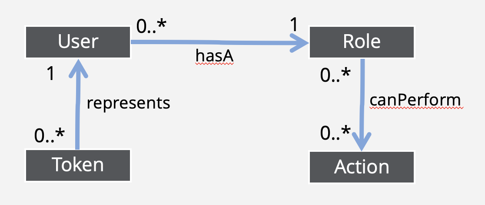

- [Role Based Access Control in Galasa](#role-based-access-control-in-galasa)
  - [Why do we need Role Based Access Control ?](#why-do-we-need-role-based-access-control-)
  - [Understanding the Galasa RBAC model](#understanding-the-galasa-rbac-model)
  - [Available Actions](#available-actions)
  - [Available Roles](#available-roles)
  - [Constraints](#constraints)
  - [Using the `galasactl` command-line tool to view roles](#using-the-galasactl-command-line-tool-to-view-roles)
  - [Using the `galasactl` command-line tool assigning a "role" to a user](#using-the-galasactl-command-line-tool-assigning-a-role-to-a-user)
  - [Using the Galasa web user interface to view your own user role](#using-the-galasa-web-user-interface-to-view-your-own-user-role)
  - [How to set the default user role](#how-to-set-the-default-user-role)

# Role Based Access Control in Galasa
Role Based Access Control (RBAC) is a well-used mechanism to assign roles to users of a system which grants such users permissions to perform some capability dictated by the role(s) they have been assigned. Here we discuss the Galasa implementation of RBAC.

## Why do we need Role Based Access Control ?
Some actions that can be performed on the Galasa Ecosystem are powerful and dangerous, such as deleting CPS properties, secrets or other resources. Giving every user of the Galasa service the ability to perform those actions is inviting disaster from inexperienced or incautions users who are not aware of the consequences of their actions.
Deleted resources could mean data being lost forever, which bears a cost to work out what was removed, and how to re-create it again. It would be far better to prevent those events occurring in the first place.

To limit the risk of such events occurring, the Galasa Service provides some Role Based Access (RBAC) mechanisms to ensure users responsible for administering the system can 
perform these powerful actions, while other users are denied access to them.

## Understanding the Galasa RBAC model 


Galasa offers a list of "actions". Each one relates to something which can be performed on the Galasa system.

Galasa has a concept of a "role", such that each role has a name and description, but also has a list of actions which someone can perform when that user has been assigned this role.

Each user has one such role, thereby indirectly associating each user with a list of actions that user can perform.

When a personal access token is used, that token is associated with the user identity the token was created for, and so also has an indirect association with a list of actions which
can be performed by a client program using that access token.

If the user has an action in the role they are assigned, then that user can perform that action.

For example, an "admin" role exists with an action CPS_PROPERTY_SET which allows a user with the "admin" role to set a CPS property. A "tester" role does not list that action, so a user with the "tester" role cannot set a CPS property.

Currently, the list of "actions" and "roles" are fixed within the system.

## Available Actions
This table shows the list of built-in actions:

| Action | What it allows you to do |
|--------|--------------------------|
| CPS_PROPERTIES_DELETE | Allows the deletion of CPS properties |
| CPS_PROPERTIES_SET | Set a CPS property value |
| GENERAL_API_ACCESS | Be able to perform basic actions on the system via the REST api |
| RUNS_DELETE_OTHER_USERS | Allows the user to delete runs that other users submitted |
| SECRETS_DELETE | Allows the deletion of secrets |
| SECRETS_GET_UNREDACTED_VALUES | Allows you to get secrets which contain the real secret value, rather than a redacted value.|
| SECRETS_SET | Allows setting of secrets |
| USER_EDIT_OTHER | Allows the editing of a different user on the system. This includes changing their role, deleting personal access tokens, or deleting the user completely. |


## Available Roles
This table shows the list of built-in roles:
| Role name | Description | Actions someone with this role can perform |
|-----------|-------------|--------------------------------------------|
| admin     | A Galasa service administrator. Anle to do any operation supported by the Galasa service. | all |
| deactivated | A user who has no permissions at all, and is able to do nothing on the Galasa service. | none |
| tester | A user who writes and runs tests, looks at the test results and diagnoses errors in the system under test.| GENERAL_API_ACCESS |


## Constraints
The system also has some constraints on how these resources can be set up and used:
- Nobody can change their own "role", assigning a different role to yourself is not permitted
- If a user existed on the Galasa service prior to the RBAC feature being available, and the Galasa service is upgraded, then all pre-existing users will be assigned the "admin" role.
- New users on the system are assigned a default role when they first login to the Galasa service. This role is configurable. More details on how to configure this default role is described in section [how to set the default user role](#how-to-set-the-default-user-role).


## Using the `galasactl` command-line tool to view roles

To list roles on the service:
```
> galasactl roles get
name        description
admin       Administrator access
deactivated User has no access
tester      Test developer and runner

Total:3
```

A role can also be queried in yaml format, where it is possible to see the list of actions that role entitles the user to perform:

```
> galasactl roles get --format yaml --name admin
apiVersion: galasa-dev/v1alpha1
kind: GalasaRole
metadata:
    id: "2"
    name: admin
    description: Administrator access
    url: http://prod1-galasa-dev.cicsk8s.hursley.ibm.com/rbac/roles/2
data:
    actions:
        - CPS_PROPERTIES_SET
        - GENERAL_API_ACCESS
        - SECRETS_GET_UNREDACTED_VALUES
        - USER_ROLE_UPDATE_ANY
        ...etc
```

## Using the `galasactl` command-line tool assigning a "role" to a user
The user role can be listed by getting the user data. For example:
```
> galasactl users get --name userName1
login-id  role   web-last-login(UTC) rest-api-last-login(UTC)
userName1 tester 2025-01-22 14:09    2025-01-22 23:15

Total:1
```

If someone has the `USER_ROLE_UPDATE_ANY` action, then they are able to do the following to change the role of a different user.
```
> galasactl users set --name userName1 --role deactivated
```

## Using the Galasa web user interface to view your own user role
The Web user interface for Galasa can be used to view your own user role.
Navigate to the "My Settings" page.

## How to set the default user role
When a new user initially logs into the Galasa web user interface, a user record is created, and that user is assigned a default user role.

The default user role is configurable by the system installer, who can set a property in the Helm values file when the Galasa service is installed or updated.

For example, in the `.values` file used by helm:
```
#
#  
# New users logging into the system get a user record created and that user is assigned a role
# by default. It should be the name of one of the roles on the system.
# Suggested values are:
#   "deactivated" - After initial logon, an administrator will need to set their most apropriate role 
#                   before this new user can access any function within the Galasa service.
#   "tester"      - After initial logon, the user is classified as a tester, so can launch tests and 
#                   see test results, but cannot administer the system.
#   "admin"       - A user with access to all the functionality provided by Galasa.
#                   We recommend only using this setting if you want every user to be an administrator
#                   (unlikely).
galasaDefaultUserRole: "tester"
```

The default will be set to "tester" unless the Galasa systems administrator wishes to change it.


