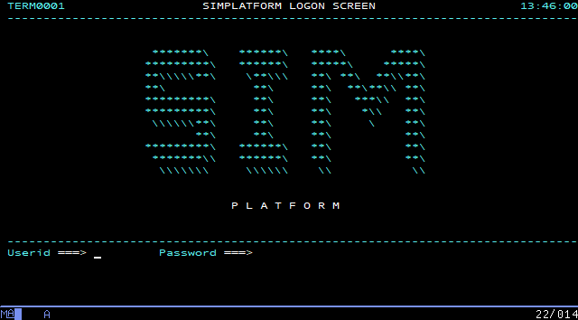
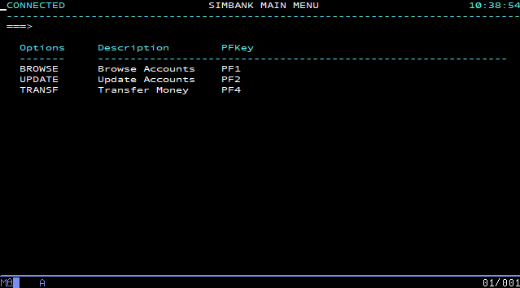

Distributed with Galasa, SimBank is a component that simulates a mainframe application. It sits above another component called SimPlatform, which exists to provide options for future growth. As delivered, SimBank implements a sample banking application against which you can configure and run a set of provided tests in preparation for running your own tests against an *actual* mainframe application. You can also practice writing some new tests to run against the SimBank banking application.

By exercising the Galasa framework against SimBank, you can pre-empt a lot (but not all) of the work and learning necessary to eventually hook your own tests up with a genuine mainframe environment. If the provided SimBank tests do not work, then it is unlikely that you will be able to run your own tests on a mainframe application. In summary, SimBank helps you to learn Galasa's basic principles of operation before you need to learn how to connect Galasa to your own mainframe application-under-test.

## Launching SimBank
If you have previously started SimBank, then choose *Run > Run Configurations* from the main menu and select and run the configuration that you created for SimBank. If not, complete the following steps:

1. Start Eclipse. 
1. From the main menu, choose *Run > Run Configurations*.
1. In the *Create, manage and run configurations* dialog, right-click *Galasa SimBank* in the left pane and choose *New Configuration*.
1. Type your preferred name for the run configuration in the *Name:* field (a relevant name such as *SimBank* is fine), press *Apply* and then *Run*. Once created, your run configuration is available for future runs.
In a few seconds, the Eclipse *Console* window responds with a series of initialization messages, which on Windows looks like:
```
2019-10-21 14:24:35 INFO dev.galasa.simplatform.main.Simplatform main Starting Simplatform ...
2019-10-21 14:24:35 INFO dev.galasa.simplatform.db.Database setDerbyHome Setting Derby home to C:\Users\<username>\AppData\Local\Temp\galasaSimplatform1440125512154994774
2019-10-21 14:24:36 INFO dev.galasa.simplatform.saf.SecurityAuthorizationFacility <init> Creating SAF service
2019-10-21 14:24:36 INFO dev.galasa.simplatform.application.Bank accountExists Checking if account: 123456789 exists
2019-10-21 14:24:36 INFO dev.galasa.simplatform.application.Bank accountExists Account doesn't exist
2019-10-21 14:24:36 INFO dev.galasa.simplatform.application.Bank openAccount Creating account: 123456789
2019-10-21 14:24:36 INFO dev.galasa.simplatform.application.Bank accountExists Checking if account: 987654321 exists
2019-10-21 14:24:36 INFO dev.galasa.simplatform.application.Bank accountExists Account doesn't exist
2019-10-21 14:24:36 INFO dev.galasa.simplatform.application.Bank openAccount Creating account: 987654321
2019-10-21 14:24:36 INFO dev.galasa.simplatform.saf.SecurityAuthorizationFacility addUser Added user: IBMUSER
2019-10-21 14:24:36 INFO dev.galasa.simplatform.main.Simplatform main Loading services...
2019-10-21 14:24:36 INFO dev.galasa.simplatform.listener.Listener <init> Loading service: dev.galasa.simplatform.listener.WebServiceListener listening on port: 2080
2019-10-21 14:24:36 INFO dev.galasa.simplatform.listener.Listener <init> Loading service: dev.galasa.simplatform.listener.TelnetServiceListener listening on port: 2023
2019-10-21 14:24:36 INFO dev.galasa.simplatform.main.Simplatform main ... services loaded
2019-10-21 14:24:36 INFO dev.galasa.simplatform.main.Simplatform main Starting Derby Network server....
2019-10-21 14:24:37 INFO dev.galasa.simplatform.main.Simplatform main ... Derby Network server started on port 2027
2019-10-21 14:24:37 INFO dev.galasa.simplatform.main.Simplatform main ... Simplatform started
```

     If you are a Mac or Linux user, the messages will be almost identical.

5. The SimBank process has been launched, and is listening on port *2023* for Telnet connections, on port *2080* for web services connections and on port *2027* for Derby SQL connections. Neither web services or Derby connections are explored further in this section.

## Manually exploring the SimBank application
When you launch SimBank, its banking application listens on port 2023 for incoming client Telnet connections, offering an opportunity to first connect to it manually to review and understand the (simulated) transactions it supports, before subjecting it to Galasa's provided tests.

### Logging in to the simulated application
1. With Eclipse and the *Galasa SimBank* component still running, configure your 3270 terminal emulator to access port *2023* of *localhost* (or IP address 127.0.0.1 if the *localhost* alias has not been set up) via the Telnet protocol. No SSL configuration is required.
1. Connect to the listening Telnet service with your 3270 emulator and review the logon screen:

    

1. Ensure that the cursor is in the `Userid` field - if it is not, use the TAB key to position it:

     

1. Enter the userid `IBMUSER`

     

1. Press TAB to move the cursor into the `Password` field, type the password `SYS1` and press your terminal emulator's ENTER key to logon and transfer to the SimBank main menu:

     

> *Note:* Depending on your terminal emulator, its ENTER key may not be mapped to the physical ENTER key on your computer. For example,
> on PCOMM, by default, the ENTER key is mapped to the host machine's right CTRL key. If you are unsure about this, review
> your terminal emulator's documentation.

6. Press PF1:

     

1. Press your terminal emulator's CLEAR SCREEN key.
1. Enter the transaction name `BANK` and press your terminal emulator's ENTER key once more to get to the SimBank main menu:

     

As you have been progressing through this process, Eclipse has been logging selected events to its console:

```
2019-08-16 09:26:39 INFO dev.galasa.simplatform.t3270.screens.AbstractScreen buildScreen Building Screen: SessionManagerLogon
2019-08-16 10:26:08 INFO dev.galasa.simplatform.saf.SecurityAuthorizationFacility authenticate User: IBMUSER authenticated
2019-08-16 10:26:08 INFO dev.galasa.simplatform.t3270.screens.AbstractScreen buildScreen Building Screen: SessionManagerMenu
2019-08-16 10:30:10 INFO dev.galasa.simplatform.t3270.screens.AbstractScreen buildScreen Building Screen: CICSGoodMorning
2019-08-16 10:36:19 INFO dev.galasa.simplatform.t3270.screens.AbstractScreen buildScreen Building Screen: CICSClearScreen
2019-08-16 10:38:54 INFO dev.galasa.simplatform.t3270.screens.AbstractScreen buildScreen Building Screen: BankMainMenu
```
This is an example of log output that can be useful when running tests.
### Browsing account information
1. From the SimBank main menu, press PF1, taking you to the account menu screen.
1. Press TAB until the cursor is in the `Account Number` field, enter `123456789` and press ENTER. 
    The account details are populated and it is apparent that account number 123456789 is 56.72 in credit.

    

1. Press PF3 to return to the account menu screen.

### Transferring funds between accounts
1. From the SimBank main menu, press PF4, taking you to the SimBank transfer menu.
1. Press TAB until the cursor is in the `Transfer from Account Number` field and enter `123456789`.
1. Press TAB until the cursor is in the `Transfer to Account Number` field and enter `987654321`.
1. Press TAB until the cursor is in the `Transfer Amount` field and enter `1`

    

1. Press ENTER - a `Transfer Successful` message appears. A log message is also written to the Eclipse *Console* window:

```
2019-08-16 13:50:53 INFO dev.galasa.simplatform.application.Bank transferMoney Transfering  1.0 from account: 123456789 to account: 987654321
```

Press PF3 and once again browse the 123456789 account as described previously to verify that its total credit has decreased by the transferred 1.00, and that the 987654321 account has increased by the same amount.

Note that SimBank also offers a web services interface on port 2080, and although it is not exercised in this topic, it *is* used by two of the provided tests - `BasicAccountCreditTest.java` and `ProvisionedAccountCreditTests.java`.

Having explored SimBank manually, it's a good time to run some or all of a small collection of automated tests that are provided with SimBank itself - to start, choose _Running the supplied SimBank tests_ in the side-menu.