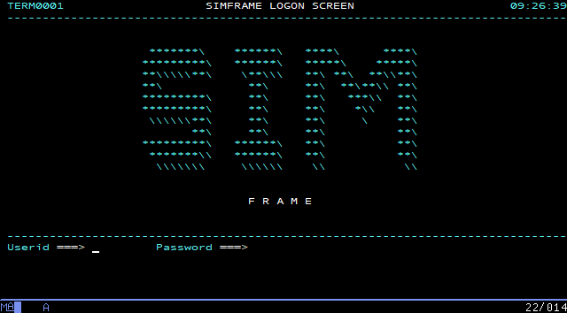
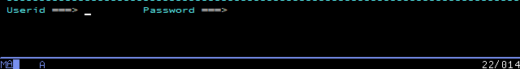
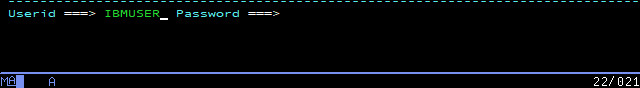
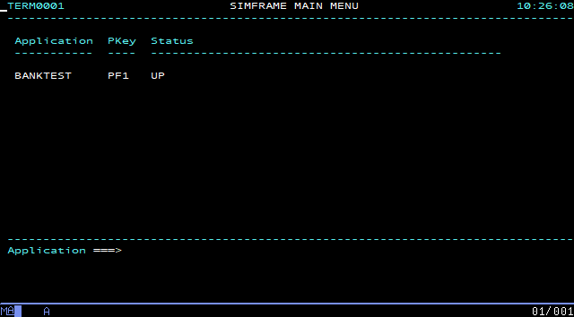
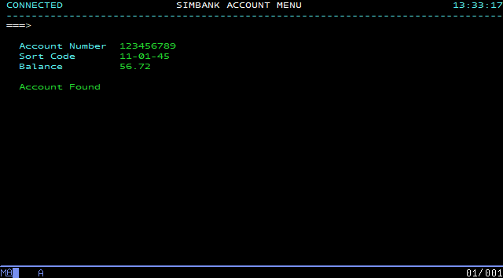
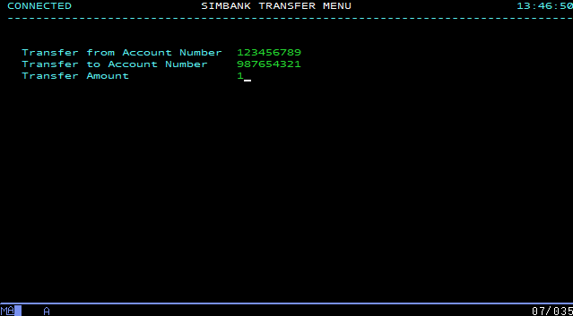

Simframe is a component distributed with Galasa that simulates a mainframe application. As delivered, it implements a toy banking application against which you can configure and run a set of provided tests in preparation for running your own tests against an *actual* mainframe application. You can also practice writing some new tests to run against Simframe's banking application.

By exercising the Galasa framework against Simframe, you can pre-empt a lot (but not all) of the work necessary to eventually hook your own tests up with a genuine mainframe environment. If the provided Simframe tests do not work, then it is unlikely that you will be able to run your own tests on a mainframe application. In summary, Simframe helps you to learn how to use Galasa in anger, exposing problems before they become major obstacles. When you become an experienced Galasa user, it is likely that you will be able to omit the Simframe stage, especially if you have been around the Simframe loop several times before.

## Launching Simframe
1. Start Eclipse.
1. From the main menu, choose *Run > Run Configurations*.
1. In the popup *Create, manage and run configurations* window, select *Galasa Simframe* in the left pane and press *New Configuration*. 
1. Type your preferred name for the run configuration in the *Name:* field, press *Apply* and then *Run*. Once created, your run configuration is available for future runs.
In a few seconds, the Eclipse *Console* window responds with a series of initialization messages, which on Windows looks like:
```
    2019-08-15 18:02:20 INFO dev.galasa.simframe.main.Simframe main Starting Simframe ...
    2019-08-15 18:02:21 INFO dev.galasa.simframe.db.Database setDerbyHome Setting Derby home to C:\Users\<Username>\AppData\Local\Temp\galasaSimframe3169992835626147051
    2019-08-15 18:02:22 INFO dev.galasa.simframe.saf.SecurityAuthorizationFacility <init> Creating SAF service
    2019-08-15 18:02:22 INFO dev.galasa.simframe.application.Bank accountExists Checking if account: 123456789 exists
    2019-08-15 18:02:22 INFO dev.galasa.simframe.application.Bank accountExists Account doesn't exist
    2019-08-15 18:02:22 INFO dev.galasa.simframe.application.Bank openAccount Creating account: 123456789
    2019-08-15 18:02:22 INFO dev.galasa.simframe.application.Bank accountExists Checking if account: 987654321 exists
    2019-08-15 18:02:22 INFO dev.galasa.simframe.application.Bank accountExists Account doesn't exist
    2019-08-15 18:02:22 INFO dev.galasa.simframe.application.Bank openAccount Creating account: 987654321
    2019-08-15 18:02:22 INFO dev.galasa.simframe.saf.SecurityAuthorizationFacility addUser Added user: IBMUSER
    2019-08-15 18:02:22 INFO dev.galasa.simframe.main.Simframe main Loading services...
    2019-08-15 18:02:22 INFO dev.galasa.simframe.listener.Listener <init> Loading service: dev.galasa.simframe.listener.WebServiceListener listening on port: 2080
    2019-08-15 18:02:22 INFO dev.galasa.simframe.listener.Listener <init> Loading service: dev.galasa.simframe.listener.TelnetServiceListener listening on port: 2023
    2019-08-15 18:02:22 INFO dev.galasa.simframe.main.Simframe main ... services loaded
```

     If you are a Mac or Linux user, the messages will be almost identical.

5. The Simframe process has been launched, and is listening on port *2023* for Telnet connections, and on port *2080* for web services connections (which are not further explored in this section).

## Manually exploring Simframe's SimBank application
When you launch Simframe, its banking application listens on port 2023 for incoming client Telnet connections, offering an opportunity to first connect to it manually to review and understand the (simulated) transactions it supports, before subjecting it to Galasa's provided tests.

### Logging in to the simulated application
1. With Eclipse and the *Galasa Simframe* component still running, configure your 3270 terminal emulator to access port *2023* of *localhost* via the Telnet protocol. 
1. Connect to the listening Telnet service with your 3270 emulator and review the logon screen:

    

1. Ensure that the cursor is in the `Userid` field - if it is not, use the TAB key to position it:

     

1. Enter the userid `IBMUSER`:

     

1. Press TAB to move the cursor into the `Password` field, type the password `SYS1` and press your terminal emulator's ENTER key to logon and transfer to the Simframe main menu:

     

> *Note:* Depending on your terminal emulator, its ENTER key may not be mapped to the physical ENTER key on your computer. For example,
> on PCOMM, by default, the ENTER key is mapped to the host machine's right CTRL key. If you are unsure about this, review
> your terminal emulator's documentation.

6. Press PF1:

     

1. Press your terminal emulator's CLEAR SCREEN key and immediately press TAB to position the cursor on an (invisible) input field which will receive the name of a simulated CICS transaction.
1. Enter the transaction name `BANK` and press your terminal emulator's ENTER key once more to get to the Simbank main menu:

     

As you have been progressing through this process, Eclipse has been logging selected events to its console:

```
2019-08-16 09:26:39 INFO dev.galasa.simframe.t3270.screens.AbstractScreen buildScreen Building Screen: SessionManagerLogon
2019-08-16 10:26:08 INFO dev.galasa.simframe.saf.SecurityAuthorizationFacility authenticate User: IBMUSER authenticated
2019-08-16 10:26:08 INFO dev.galasa.simframe.t3270.screens.AbstractScreen buildScreen Building Screen: SessionManagerMenu
2019-08-16 10:30:10 INFO dev.galasa.simframe.t3270.screens.AbstractScreen buildScreen Building Screen: CICSGoodMorning
2019-08-16 10:36:19 INFO dev.galasa.simframe.t3270.screens.AbstractScreen buildScreen Building Screen: CICSClearScreen
2019-08-16 10:38:54 INFO dev.galasa.simframe.t3270.screens.AbstractScreen buildScreen Building Screen: BankMainMenu
```
### Browsing account information
1. From the Simbank main menu, press PF1, taking you to the account menu screen.
1. Press TAB until the cursor is in the `Account Number` field, enter `123456789` and press ENTER. 
    The account details are populated and it is apparent that account number 123456789 is 56.72 in credit.

    

1. Press PF3 to return to the account menu screen.

Note that while it is a menu option, the `Update Accounts` functionality has not been implemented.

### Transferring funds between accounts
1. From the Simbank main menu, press PF4, taking you to the Simbank transfer menu.
1. Press TAB until the cursor is in the `Transfer from Account Number` field and enter `123456789`.
1. Press TAB until the cursor is in the `Transfer to Account Number` field and enter `987654321`.
1. Press TAB until the cursor is in the `Transfer Amount` field and enter `1`

    

1. Press ENTER - a `Transfer Successful` message appears. A log message is also written to the Eclipse *Console* window:

```
2019-08-16 13:50:53 INFO dev.galasa.simframe.application.Bank transferMoney Transfering  1.0 from account: 123456789 to account: 987654321
```

1. Press PF3 and once again browse the 123456789 account as described previously to verify that its total credit has decreased by the transferred 1.00.

Having explored Simframe manually, it's a good time to run some or all of a small collection of automated tests that are provided with Simframe itself - to start, choose *Running the provided Simframe tests* in the side-menu.