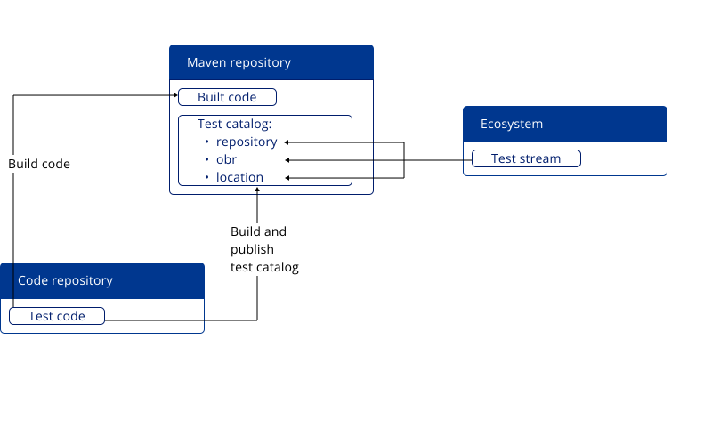

Galasa's Ecosystem organises tests into _streams_. Test streams give you more options when it comes to organising your test projects, how often they are built and where they are deployed.

A test stream is a group of tests that you want to run in automation, represented by a single OBR (OSGi Bundle Repository) and its equivalent test catalog. Galasa uses the OBR to locate your tests in a Maven repository, along with all of the Managers that a test project requires. A test catalog is generated directly from the test source, is always up to date, and is specified in the Galasa CLI to select tests to run in automation. Administrators can create few or many test streams, depending on testing requirements. Testers can contribute tests to one or more test streams.

## Test stream components

A test stream is made up of a name, description, OBR, location and repository components. 

- The OBR component is a URL that points to a list of Maven coodinates in the format `mvn:{grp}/{artifact id}/{version}/{obr}`. 
- The location component is a URL that points to the location of the test catalog that is associated with a particular OBR in the format `http://points-to-my-testcatalog`. A test catalog is an index of tests.  

- The repository component provides the location of the Maven repository where the test code and test catalog are deployed

The following diagram shows the relationship between the test code, test catalog, and test stream.




## Creating and retrieving test stream components

The components of the `test.stream` property are set by using `galasactl properties set` command, as shown in the following example:

```
galasactl properties set --namespace framework --name test.stream.mystream.description --value "My stream to use as an example"
galasactl properties set --namespace framework --name test.stream.mystream.repo --value http://points-to-my-maven-repo
galasactl properties set --namespace framework --name test.stream.mystream.location --value http://points-to-my-test-catalog
galasactl properties set --namespace framework --name test.stream.mystream.obr --value mvn:myorg/myartifact/0.0.1/obr
```

These four commands each set a part of the stream. Streams must always be created in the `framework` namespace and must always have all four components set.

You can view all test streams in the `framework` namespace by using the `galasactl properties get` command, as shown in the following example:

```
galasactl properties get --namespace framework --name test.streams 
namespace name         value 
framework test.streams integrationtests, regressiontests 

Total:2
```

## Organising test streams

There are many ways to organise test streams:

- <b>Single test stream</b>: A single test stream can contain all of your tests. This system is of most use when you are learning about Galasa and experimenting with the automation system. At some point, it is much more beneficial for you to move to a dual stream setup.
- <b>Dual test streams</b>: Often, you will need to run a _production_ test stream and a _best so far_ test stream. The production stream is used by the CI/CD pipeline to test the application, while the best so far stream will include tests under development that you wish to observe under automation.

  The source code for tests in dual streams is usually from the same SCM (Source Code Management) area - in git terms, this would mean the same repository but in different branches. The best so far stream contains all of the production stream tests plus new or modified tests. When you are happy that a test has reached a good level of quality, you can promote it to the production stream and make it available to the CI/CD pipeline. Usually, you would organise things so that you have a Maven build per stream.

- <b>Many streams</b>: You might organise your streams so that you have one per team, or dual test streams per team. If you have lots of tests per application area, having a stream per area is also possible.

Build time and frequency usually dictates how streams are structured. If you are building your test projects frequently, and those build times are long, you might wish to split the test projects into streams. Alternatively, you could stick with a single stream, but split the projects into separate builds that all kick off the build of the test stream OBR when complete.
