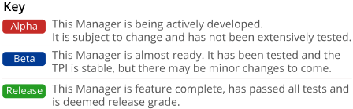

You can find the links to the Javadoc API documentation for all the Galasa Managers on the <a href="https://javadoc.galasa.dev/" target="_blank"> overview page</a>. 

You can view the <a href="https://github.com/galasa-dev/managers/tree/main/galasa-managers-parent" target="_blank"> installation verification tests (IVTs)</a> for the Managers in GitHub. 

## Managers provided with the current Galasa distribution

<b>CICS TS Managers</b>

 Name   |                                                                                                               | Description                                                                                                                                                                                                                                                                                                                                                                                                                                                                                                                                                                                                                                                                                                                                                                                                                                                                                                                                                                         |
| :-------------------------------------------------------------------------------------------------------------------- | :---------------------------------------------------------------------------------------------------------------------------------------------------------------------------------------------------------------------------------------------------------------------------------------------------------------------------------------------------------------------------------------------------------------------------------------------------------------------------------------------------------------------------------------------------------------------------------------------------------------------------------------------------------------------------------------------------------------------------------------------------------------------------------------------------------------------------------------------------------------------------------------------------------------------------------------------------------------------------------- |
| **[CECI Manager](/docs/managers/cics-ts-ceci-manager)**                              | Provides CECI 3270 interaction - initially supporting containers and link programs.                                                                                                                                                                                                                                                                                                                                                                                                                                                                                                                                                                                                                                                                                                                                                                                                                                                                                                 |
| **CEDA Manager**                              | Provides CEDA 3270 interaction.                                                                                                                                                                                                                                                                                                                                                                                                                                                                                                                                                                                                                                                                                                                                                                                                                                                                                                 |
| **CEMT Manager**                              | Provides CEMT 3270 interaction.                                                                                                                                                                                                                                                                                                                                                                                                                                                                                                                                                                                                                                                                                                                                                                                                                                                                                                 |
| **[CICS TS Manager](/docs/managers/cics-ts-manager)**                              | Provides configuration information for pre-existing CICS TS servers. Drives provisioning services from other managers, e.g. z/OS PT.                                                                                                                                                                                                                                                                                                                                                                                                                                                                                                                                                                                                                                                                                                                                                                                                                                                                                                 |

<b>Cloud Managers</b>

 Name   |                                                                                                               | Description                                                                                                                                                                                                                                                                                                                                                                                                                                                                                                                                                                                                                                                                                                                                                                                                                                                                                                                                                                         |
| :-------------------------------------------------------------------------------------------------------------------- | :---------------------------------------------------------------------------------------------------------------------------------------------------------------------------------------------------------------------------------------------------------------------------------------------------------------------------------------------------------------------------------------------------------------------------------------------------------------------------------------------------------------------------------------------------------------------------------------------------------------------------------------------------------------------------------------------------------------------------------------------------------------------------------------------------------------------------------------------------------------------------------------------------------------------------------------------------------------------------------- |
| **[Docker Manager](/docs/managers/docker-manager)**                            | Enables containers to run on infrastructure Docker engines - either for testing directly or for assisting the testing process.                                                                                                                                                                                                                                                                                                                                                                                                                                                                                                                                                                                                                                                                                                                                                                                                                                                      |
| **[Kubernetes Manager](/docs/managers/kubernetes-manager)**                        | Provisions Kubernetes namespaces for tests (or Managers) to use.                                                                                                                                                                                                                                                                                                                                                                                                                                                                                                                                                                                                                                                                                                                                                                                                                                                                                                                    |
| **[OpenStack Manager](/docs/managers/open-stack-manager)**                                                              | Provisions Linux images on  servers within OpenStack. This Manager currently supports only Linux and provides the servers via the Linux Manager.     

<b>Communications Managers</b>

 Name   |                                                                                                               | Description                                                                                                                                                                                                                                                                                                                                                                                                                                                                                                                                                                                                                                                                                                                                                                                                                                                                                                                                                                         |
| :-------------------------------------------------------------------------------------------------------------------- | :---------------------------------------------------------------------------------------------------------------------------------------------------------------------------------------------------------------------------------------------------------------------------------------------------------------------------------------------------------------------------------------------------------------------------------------------------------------------------------------------------------------------------------------------------------------------------------------------------------------------------------------------------------------------------------------------------------------------------------------------------------------------------------------------------------------------------------------------------------------------------------------------------------------------------------------------------------------------------------- |
| **[HTTP Client Manager](/docs/managers/http-client-manager)**                        | Provides a common setup of HTTP client operations for the test (or a Manager) to use.                                                                                                                                                                                                                                                                                                                                                                                                                                                                                                                                                                                                                                                                                                                                                                                                                                                                                               |
| **[IP Network Manager](/docs/managers/ipnetwork-manager)**                                                             | Provides configuration information for IP-based servers.                                                                                                                                                                                                                                                                                                                                                                                                                                                                                                                                                                                                                                                                                                                                                                                                                                                                                                                            |
| **[MQ Manager](/docs/managers/mq-manager)**                        | Provides the ability to connect to an existing Queue Manager and enables applications to read and write one or more messages to and from a queue.                                                                                                                                                                                                                                                                                                                                                                                                                                                                                                                                                                                                                                                                                                                                                                                                                                                                                                                    |

<b>Core Managers</b>

 Name   |                                                                                                               | Description                                                                                                                                                                                                                                                                                                                                                                                                                                                                                                                                                                                                                                                                                                                                                                                                                                                                                                                                                                         |
| :-------------------------------------------------------------------------------------------------------------------- | :---------------------------------------------------------------------------------------------------------------------------------------------------------------------------------------------------------------------------------------------------------------------------------------------------------------------------------------------------------------------------------------------------------------------------------------------------------------------------------------------------------------------------------------------------------------------------------------------------------------------------------------------------------------------------------------------------------------------------------------------------------------------------------------------------------------------------------------------------------------------------------------------------------------------------------------------------------------------------------- |
| **[Artifact Manager](/docs/managers/artifact-manager)**                        | Provides access to resources within a test bundle. It also provides templating services.                                                                                                                                                                                                                                                                                                                                                                                                                                                                                                                                                                                                                                                                                                                                                                                                                                                                                            |
| **[Core Manager](/docs/managers/core-manager)**   | The Core Manager provides tests with access to some of the core features within the Galasa Framework. The Core Manager is always initialised and included in a test run and contributes the logger, stored artefact root and test property annotations.                                                                                                                                                                                                                                                                                                                                                                                                                                                                                                                                                                                                                                                                                                                                                                                                            |

<b>Logging Managers</b>

 Name   |                                                                                                               | Description                                                                                                                                                                                                                                                                                                                                                                                                                                                                                                                                                                                                                                                                                                                                                                                                                                                                                                                                                                         |
| :-------------------------------------------------------------------------------------------------------------------- | :---------------------------------------------------------------------------------------------------------------------------------------------------------------------------------------------------------------------------------------------------------------------------------------------------------------------------------------------------------------------------------------------------------------------------------------------------------------------------------------------------------------------------------------------------------------------------------------------------------------------------------------------------------------------------------------------------------------------------------------------------------------------------------------------------------------------------------------------------------------------------------------------------------------------------------------------------------------------------------- |
| **[ElasticLog Manager](/docs/managers/elasticlog-manager)**                        | Exports test results to ElasticSearch, which can be subsequently used within Kibana dashboards.                                                                                                                                                                                                                                                                                                                                                                                                                                                                                                                                                                                                                                                                                                                                                                                                                                                                                     |

<b>Ecosystem Managers</b>

 Name   |                                                                                                               | Description                                                                                                                                                                                                                                                                                                                                                                                                                                                                                                                                                                                                                                                                                                                                                                                                                                                                                                                                                                         |
| :-------------------------------------------------------------------------------------------------------------------- | :---------------------------------------------------------------------------------------------------------------------------------------------------------------------------------------------------------------------------------------------------------------------------------------------------------------------------------------------------------------------------------------------------------------------------------------------------------------------------------------------------------------------------------------------------------------------------------------------------------------------------------------------------------------------------------------------------------------------------------------------------------------------------------------------------------------------------------------------------------------------------------------------------------------------------------------------------------------------------------- |
| **[Galasa Ecosystem Manager](/docs/managers/galasa-ecosystem-manager)**            | Deploys an entire Galasa ecosystem to Kubernetes to enable integration testing against Galasa.                                                                                                                                                                                                                                                                                                                                                                                                                                                                                                                                                                                                                                                                                                                                                                                                                                                                                      |

<b>Test Tool Managers</b>

 Name   |                                                                                                               | Description                                                                                                                                                                                                                                                                                                                                                                                                                                                                                                                                                                                                                                                                                                                                                                                                                                                                                                                                                                         |
| :-------------------------------------------------------------------------------------------------------------------- | :---------------------------------------------------------------------------------------------------------------------------------------------------------------------------------------------------------------------------------------------------------------------------------------------------------------------------------------------------------------------------------------------------------------------------------------------------------------------------------------------------------------------------------------------------------------------------------------------------------------------------------------------------------------------------------------------------------------------------------------------------------------------------------------------------------------------------------------------------------------------------------------------------------------------------------------------------------------------------------- |
| **[JMeter Manager](/docs/managers/jmeter-manager)**                                  | Configures and runs JMeter testing via Docker containers.                                                                                                                                                                                                                                                                                                                                                                                                                                                                                                                                                                                                                                                                                                                                                                                                                                                                                                                           |
| **[Selenium Manager](/docs/managers/selenium-manager)**                              | Allows tests to drive Web Browser testing using Selenium.                                                                                                                                                                                                                                                                                                                                                                                                                                                                                                                                                                                                                                                                                                                                                                                                                                                                                                                           |

<b>Unix Managers</b>

 Name   |                                                                                                               | Description                                                                                                                                                                                                                                                                                                                                                                                                                                                                                                                                                                                                                                                                                                                                                                                                                                                                                                                                                                         |
| :-------------------------------------------------------------------------------------------------------------------- | :---------------------------------------------------------------------------------------------------------------------------------------------------------------------------------------------------------------------------------------------------------------------------------------------------------------------------------------------------------------------------------------------------------------------------------------------------------------------------------------------------------------------------------------------------------------------------------------------------------------------------------------------------------------------------------------------------------------------------------------------------------------------------------------------------------------------------------------------------------------------------------------------------------------------------------------------------------------------------------- |
| **[Linux Manager](/docs/managers/linux-manager)**                                                                  | Connect to a Linux image and run commands on that image via the command shell.  Drive provisioning of images by using other Managers, for example, the OpenStack Manager. The Linux Manager depends on the IP Network Manager to provide the IP connection to the Linux image.                                                                                                                                                                                                                                                                                                                                                                                                                                                                                                                                                                                                                                                                                                                                                                                                                                                               |

<b>z/OS Managers</b>

 Name   |                                                                                                               | Description                                                                                                                                                                                                                                                                                                                                                                                                                                                                                                                                                                                                                                                                                                                                                                                                                                                                                                                                                                         |
| :-------------------------------------------------------------------------------------------------------------------- | :---------------------------------------------------------------------------------------------------------------------------------------------------------------------------------------------------------------------------------------------------------------------------------------------------------------------------------------------------------------------------------------------------------------------------------------------------------------------------------------------------------------------------------------------------------------------------------------------------------------------------------------------------------------------------------------------------------------------------------------------------------------------------------------------------------------------------------------------------------------------------------------------------------------------------------------------------------------------------------- |
| **[RSE API Manager](/docs/managers/rse-api-manager)**                        | Provides tests and Managers with access to RSE API functions.                                                                                                                                                                                                                                                                                                                                                                                                                                                                                                                                                                                                                                                                                                                                                                                                                                                                                            |                                                                                      
| **[z/OS 3270 Manager](/docs/managers/zos3270terminal-manager)**                                                              | Provides tests and Managers with a 3270 client.                                                                                                                                                                                                                                                                                                                                                                                                                                                                                                                                                                                                                                                                                                                                                                                                                                                                                                                                     |
| **[z/OS Batch z/OS MF Manager](/docs/managers/z-os-batch-z-os-mf-manager)**          | Provides the default implementation of the z/OS Batch Manager using z/OS MF. Can only be used via the z/OS Batch Manager interface.    |        
| **[z/OS Batch RSE API Manager](/docs/managers/z-os-batch-rse-api-manager)**          | Provides an implementation of the z/OS Batch Manager using the RSE API. Can only be used via the z/OS Batch Manager interface.    |     
| **[z/OS Console oeconsol Manager](/docs/managers/zos-console-oeconsol-manager)**        | Provides an implementation of the z/OS Console by using the z/OS UNIX oeconsol command. Can only be used via the z/OS Console Manager interface.      |                                                                                 
| **[z/OS Console z/OS MF Manager](/docs/managers/zos-console-zos-mf-manager)**        | Provides the default implementation of the z/OS Console by using z/OS MF. Can only be used via the z/OS Console Manager interface.      |
| **[z/OS File RSE API Manager](/docs/managers/z-os-file-rse-api-manager)**        | Provides an implementation of the z/OS File Manager by using RSE API. Can only be used via the z/OS File Manager interface.      |                                                                                               
| **[z/OS File z/OS MF Manager](/docs/managers/zos-file-zos-mf-manager)**              | Provides the default implementation of the z/OS File Manager using z/OS MF. Can only be used via the z/OS File Manager interface.                                                                                                                                                                                                                                                                                                                                                                                                                                                                                                                                                                                                                                                                                                                                                                                                                                                   |                        
| **[z/OS Manager](/docs/managers/zos-manager)**                                       | Provides tests and Managers with access to z/OS images, sysplexes and log information. Additionally, the z/OS Manager contributes annotations which allow you to run batch jobs, issue console commands, transfer files and securely access z/OS systems via TSO or UNIX commands.   |                                                                                         
| **[z/OS MF Manager](/docs/managers/zos-mf-manager)**                                 | Provides tests and Managers with access to z/OS MF functions.  
| **[z/OS Program Manager](/docs/managers/zos-program-manager)**     | Compiles test programs from source embedded in the Galasa test bundle at test start. The executable load module is then available for use in the test.                                                                                                                                                                                                                                                                                                                                                                                                                                                                                                                                                                                                                                                                   
| **[z/OS TSO Command SSH Manager](/docs/managers/zos-tso-command-ssh-manager)**     | Provides the default implementation of the z/OS TSO Command Manager using SSH. Can only be used via the z/OS TSO Command Manager interface.                                                                                                                                                                                                                                                                                                                                                                                                                                                                                                                                                                                                                                                                                                                                                                                                                                         |
| **[z/OS UNIX Command SSH Manager](/docs/managers/zos-unix-command-ssh-manager)**   | Provides the default implementation of the z/OS UNIX Command Manager using SSH. Can only be used via the z/OS UNIX Command Manager interface.    
                                                                                                                                                                                                                                                                                                                                                                                                                                                                                                                                                                                                                                                                                                                                                                                                                                 |

## Future Managers

| Name                                  | Description                                                                                                                          |
| ------------------------------------- | :----------------------------------------------------------------------------------------------------------------------------------- |
| **AIX Manager**                       | Provisions AIX server configuration properties, and helps drive provisioning by other Managers such as the OpenStack Manager.        |
| **Artifactory Manager**               | Provides the ability to retrieve artifacts from Artifactory servers.                                                                 |
| **CICS z/OS PT Provisioning Manager** | Provisions CICS TS servers for the CICS TS Manager.                                                                                  |
| **GitHub Manager**                    | Enables tests to retrieve artifacts from GitHub and enables test results to be influenced by the status of issues.                   |
| **GitLab Manager**                    | Enables tests to retrieve artifacts from GitLab and enables test results to be influenced by the status of issues.                   |
| **IMS DB Manager**                    | Provisions and configures IMS DB subsystems.                                                                                         |
| **IMS TM Manager**                    | Provisions and configures IMS TM subsystems.                                                                                         |
| **ISPF Manager**                      | Provides a wrapper for the z/OS 3270 Manager to run ISPF sessions.                                                                   |
| **Liberty Manager**                   | Provisions and configures Liberty servers.                                                                                           |
| **MongoDB Manager**                   | Provisions and configures MongoDB databases via Docker containers.                                                                   |
| **Nexus Manager**                     | Provides the ability to retrieve artifacts from Nexus servers.                                                                       |
| **OpenLDAP Manager**                  | Provides and configures OpenLDAP servers via Docker containers.                                                                      |
| **RTC Manager**                       | Enables tests to retrieve artifacts from RTC, and allows test results to be influenced by the status of defects.                     |
| **TSO Manager**                       | Provides a wrapper for the z/OS 3270 Manager to run TSO sessions.                                                                    |
| **UrbanCode Manager**                 | Provisions and configures UrbanCode servers.                                                                                         |
| **WAS Manager**                       | Provisions and configures Websphere Application Servers.                                                                             |
| **Windows Manager**                   | Provides Windows server configuration properties, driving provisioning by other Managers such as the OpenStack Manager.              |
| **WSIM Manager**                      | Provisions and configures Workload Simulator servers.                                                                                |
| **z/Linux Manager**                   | Provides z/Linux server configuration properties, and drives provisioning by other Managers such as the z/VM Manager.                |
| **z/OS Connect Manager**              | Provides configuration information for z/OS Connect instances, and provisions z/OS Connect instances.                                |
| **z/OS DB2 Manager**                  | Providing configuration information to DB2 instances, this Manager also provisions DB2 instances and schemas.                        |
| **z/OS MQ Manager**                   | Provisions and configures z/OS MQ subsystems.                                                                                        |
| **z/OS Security Manager**             | Creates and maintains userids and profiles in RACF.                                                                                  |
| **z/VM Manager**                      | Provisions and configures z/VM userids, mainly for provisioning z/OS and z/Linux systems.                                            |
| **ZOWE Manager**                      | Provides configuration information for and provisions ZOWE instances.                                                                |
