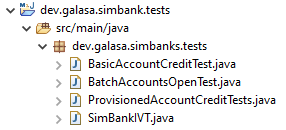

Galasa SimBank comes with a selection of prepared Galasa tests:

- A basic Installation Verification Test (IVT) logs on to SimBank and examines an account - `SimBankIVT.java`.
- A test that updates an account using web services and examines the changes with 3270 screens - `BasicAccountCreditTest.java`.
- A test that uses a provisioned account object to perform the same test as `BasicAccountCreditTest.java` in an improved test design - `ProvisionedAccountCreditTests.java`.
- A test that exercises the z/OS Batch Manager by simulating the submission of a JCL job to add a number of accounts to the SimBank system - `BatchAccountsOpenTest.java`.

All of these example tests become available when you set up a Galasa example project within Eclipse. 

If you are using the Galasa zipped distribution you must use Gradle to build your projects, so follow the instructions in the [_Creating an example Galasa project using Gradle_](#headgradle) section. 

If you are using the Galasa plug-in from the update site, use Maven to build your projects, following the instructions in the [_Creating an example Galasa project using Maven_](#headmaven) section.

Note that there are some variations in the Eclipse interface, depending on the version of Eclipse that you are using.

## <a name="headgradle"></a>Creating an example Galasa project using Gradle

1. Ensure that Eclipse is running.
1. Depending on your operating system, choose _Window > Preferences > Galasa_ or _Eclipse > Preferences > Galasa_ and change the _Remote Maven URI_ to the local Maven directory, for example, `file:///home/username/galasa-isolated-mvp/maven` to enable running tests to access any dependencies. <br>
Note: If you are using the Docker image, set the URL to the running container, for example, `http://localhost:8080/maven`.
1. Click _Apply and Close_.
1. Choose _File > New > Example_, select _SimBank example Gradle projects_ and click _Next_.
1. Confirm your _New project_ prefix (it's OK to leave it as `dev.galasa.simbank`) and press _Finish_. In your _Package Explorer_ (if it's not visible, choose _Window > Show View > Package Explorer_), three new entries appear:  
```  
dev.galasa.simbank.parent
dev.galasa.simbank.manager  
dev.galasa.simbank.tests  
```  
1. Add a ```pluginManagement``` section, at the top of the `settings.gradle` file in `dev.galasa.simbank.parent` so that the Gradle build can search the Maven directory for any required plug-ins. Specify the Maven repository as the location of the unzipped Maven directory. For example:
```
pluginManagement {
    repositories {
        maven {
            url = "file:///home/username/galasa-isolated-mvp/maven"
        }
    }
}
```
Note: If you are using the Docker image, set the URL to the running container. For example:
```
pluginManagement {
    repositories {
        maven {
            url = "http://localhost:8080/maven"
        }
    }
}
```  
1. In `dev.galasa.simbank.manager`, modify the `build.gradle` file so that the  individual projects can locate any dependencies that they might require for building. In the repositories closure, replace `mavenCentral()` with the location of the unzipped Maven directory. For example:
```
repositories {
        maven {
            url = "file:///home/username/galasa-isolated-mvp/maven"
        }
}
```
Note: If you are using the Docker image, set the URL to the running container. For example:
```
repositories {
        maven {
            url = "http://localhost:8080/maven"
        }
}
```
1. In `dev.galasa.simbank.tests`, modify the `build.gradle` file by making the same repository change as you did to the `build.gradle` file in `dev.galasa.simbank.manager`. In addition, modify the Selenium Manager dependency in the file to remove packages that are not required. Change the dependency from:
```
implementation'dev.galasa:dev.galasa.selenium.manager:0.+'
```
to:
```
implementation('dev.galasa:dev.galasa.selenium.manager:0.+'){
        exclude group: 'com.squareup.okio', module: 'okio'
        exclude group: 'com.squareup.okhttp3', module: 'okhttp'
        exclude group: 'net.bytebuddy', module: 'byte-buddy'
        exclude group: 'org.apache.commons', module: 'commons-exec'
        exclude group: 'com.google.guava', module: 'guava'
}
```
1. In Project Explorer, right-click on `dev.galasa.simbank.parent` and select _Gradle > Refresh Gradle Project_<br>
Note: If you get an error connecting to the Gradle build, go to _Window > Preferences > Gradle_,  check the _Local installation directory_ box, browse to the folder in which you installed Gradle and click _OK_ and _Apply and Close_.
1. Navigate to *Run > Run Configurations*. The *Create, manage and run configurations* dialog box appears. 
1. Depending on version of Eclipse that you are using, either right-click *Gradle Project* and choose *New Configuration* or select _Gradle Task > add clean build_. 
1. Provide a meaningful name and (depending on your version of Eclipse) add either  ```clean build``` in the `Gradle Tasks` field or click *Add* and type `clean` in the `Gradle Tasks` field and then click *Add* again and type `build`. <br> Note: If you encounter an error, try running the `gradle clean build` command from the command line to generate more detailed error messages. 
1. Click *Workspace*, select `dev.galasa.simbank.parent` and click `OK`.
1. Click `Apply` then `Run`.
1. Expand `dev.galasa.simbank.tests` (assuming you haven't changed your project name) and then `src.main.java` - and finally, explore the `dev.galasa.simbanks.tests` package. You'll see the group of tests provided with SimBank:



Explore these tests by selecting from the left-hand menu - if you are new to Galasa, _The SimBank IVT_ is the best place to start.

## <a name="headmaven"></a>Creating an example Galasa project using Maven

<b>NOTE:</b> Normally m2e (the Eclipse Maven plug-in) automatically compiles the test bundles and produces the necessary manifest and OSGi files. However, there appears to be an anomaly in m2e in the 2019 versions of Eclipse which we are investigating. If the bundles fail to build correctly, you can force the Maven build by right-clicking the _project_ and selecting _Run As > Maven Install_. We will resolve this issue in a future release.

1. Ensure that Eclipse is running.
2. Choose _File > New > Example_, select _SimBank example Maven projects_ and click _Next_.
3. Confirm your _New project_ prefix (it's OK to leave it as `dev.galasa.simbank`) and press _Finish_. In your _Package Explorer_ (if it's not visible, choose _Window > Show View > Package Explorer_), two new entries appear:  
```  
dev.galasa.simbank.manager  
dev.galasa.simbank.tests  
```  
4. Right-click on `dev.galasa.simbank.manager` and choose _Run As > Maven install_ - wait a few moments for the dependencies to load and then right-click on `dev.galasa.simbank.tests` and do the same. Note that the order in which you do this is significant - first `dev.galasa.simbank.manager` and then `dev.galasa.simbank.tests`.  
5. Expand `dev.galasa.simbank.tests` (assuming you haven't changed your project name) and then `src.main.java` - and finally, explore the `dev.galasa.simbanks.tests` package. You'll see the group of tests provided with SimBank:


Explore these tests by selecting from the left-hand menu - if you are new to Galasa, _The SimBank IVT_ is the best place to start.

