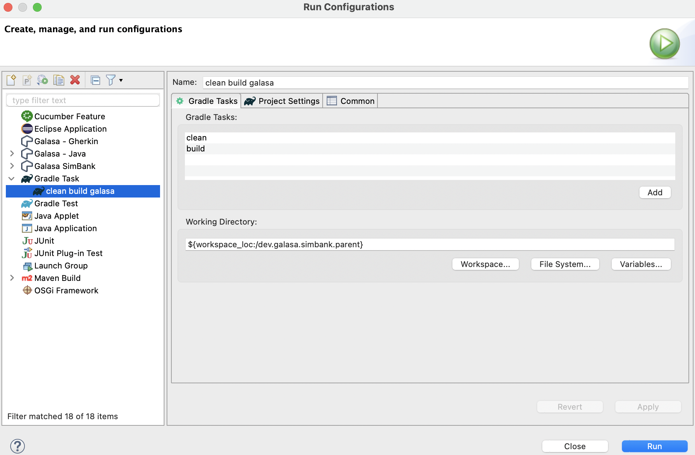
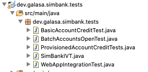

Galasa SimBank comes with a selection of prepared Galasa tests:

- A basic Installation Verification Test (IVT) which logs on to SimBank  - `SimBankIVT.java`.
- A test that updates an account using web services and examines the changes with 3270 screens - `BasicAccountCreditTest.java`.
- A test that uses a provisioned account object to perform the same test as `BasicAccountCreditTest.java` in an improved test design - `ProvisionedAccountCreditTests.java`.
- A test that exercises the z/OS Batch Manager by simulating the submission of a JCL job to add a number of accounts to the SimBank system - `BatchAccountsOpenTest.java`.

All of these example tests become available when you set up a Galasa example project within Eclipse. 

If you are using the Galasa plug-in from the external update site and are using Maven, follow the instructions in the [_Creating an example Galasa project using Maven_](#headmaven) section.

If you are using the Galasa plug-in from the external update site and are using Gradle, follow the instructions in the [_Creating an example Galasa project using Gradle_](#headonlinegradle) section. 

If you are using the Galasa zipped distribution you must use Gradle to build your project, so follow the instructions in the [_Creating an example Galasa project using Gradle (zipped distribution)_](#headgradle) section. 

Note that there are some variations in the Eclipse interface, depending on the version of Eclipse that you are using.

## <a name="headmaven"></a>Creating an example Galasa project using Maven

<b>NOTE:</b> Normally m2e (the Eclipse Maven plug-in) automatically compiles the test bundles and produces the necessary manifest and OSGi files. However, there appears to be an anomaly in m2e in the 2019 versions of Eclipse which we are investigating. If the bundles fail to build correctly, you can force the Maven build by right-clicking the _project_ and selecting _Run As > Maven Install_. We will resolve this issue in a future release.

1. Ensure that Eclipse is running.
2. Choose _File > New > Example_, select _SimBank example Maven projects_ and click _Next_.
3. Confirm your _New project_ prefix as `dev.galasa.simbank` and press _Finish_. In your _Package Explorer_ (if it's not visible, choose _Window > Show View > Package Explorer_), two new entries appear:  
    ```  
    dev.galasa.simbank.manager  
    dev.galasa.simbank.tests  
    ```  
4. Right-click on `dev.galasa.simbank.manager` and choose _Run As > Maven install_ - wait a few moments for the Maven build and then right-click on `dev.galasa.simbank.tests` and do the same. Note that the order in which you do this is significant - first `dev.galasa.simbank.manager` and then `dev.galasa.simbank.tests`. This is because the SimBank tests have a dependency on the SimBank Manager.
5. Expand `dev.galasa.simbank.tests` and then expand `src/main/java`. 
6. Explore the `dev.galasa.simbanks.tests` package. You'll see the group of tests provided with SimBank:
    

Explore these tests by selecting from the left-hand menu - if you are new to Galasa, [The SimBank IVT](/docs/running-simbank-tests/simbank-IVT) is the best place to start.

## <a name="headonlinegradle"></a>Creating an example Galasa project using Gradle

1. Ensure that Eclipse is running.
2. Depending on your operating system, choose either _Window > Preferences_ or _Eclipse > Preferences_, check that you are using the correct version of Gradle.
3. Choose _File > New > Example_, select _SimBank example Gradle projects_ and click _Next_.
4. Confirm your _New project_ prefix as `dev.galasa.simbank` and press _Finish_. In your _Package Explorer_ (if it's not visible, choose _Window > Show View > Package Explorer_), three new entries appear:  
    ``` 
    dev.galasa.simbank.manager   
    dev.galasa.simbank.parent
    dev.galasa.simbank.tests  
    ```  
5. In Project Explorer, right-click on `dev.galasa.simbank.parent` and select _Gradle > Refresh Gradle Project_. A _BUILD SUCCESSFUL_ message is displayed in the _Console_ tab when the project is refreshed successfully.<br>
    <b>Note:</b> If you get an error connecting to the Gradle build, go to _Window > Preferences > Gradle_,  check the _Local installation directory_ box, browse to the folder in which you installed Gradle and click _OK_ and _Apply and Close_.  
6. Navigate to *Run > Run Configurations*. The *Create, manage and run configurations* dialog box appears. 
7. Depending on version of Eclipse that you are using, either right-click *Gradle Project* or *Gradle Task* and choose *New Configuration*. 
8. Provide a meaningful name and set up your Gradle Task to run a clean build. 
    
9. In _Working Directory_, click *Workspace*, select `dev.galasa.simbank.parent` and click `OK`.
10. Click _Apply_ then _Run_. A _BUILD SUCCESSFUL_ message is displayed in the _Console_ tab.
11. Expand `dev.galasa.simbank.tests` and then expand `src/main/java`.
12. Explore the `dev.galasa.simbank.tests` package. You'll see the group of tests provided with SimBank:
    

Explore these tests by selecting from the left-hand menu - if you are new to Galasa, [The SimBank IVT](/docs/running-simbank-tests/simbank-IVT) is the best place to start.


## <a name="headgradle"></a>Creating an example Galasa project using Gradle (zipped distribution)

1. Ensure that Eclipse is running.
2. Depending on your operating system, choose either _Window > Preferences_ or _Eclipse > Preferences_, check that you are using the correct version of Gradle, and then select `Galasa` from the left hand pane.
3. Change the _Remote Maven URI_ to the local Maven directory, for example, `file:///home/username/galasa-isolated-mvp/maven` to enable running tests to access any dependencies. <br>
    <b>Note:</b> If you are using the Docker image, set the URL to the running container, for example, `http://hostname:8080/maven`.
4. Click _Apply and Close_.
5. Choose _File > New > Example_, select _SimBank example Gradle projects_ and click _Next_.
6. Confirm your _New project_ prefix as `dev.galasa.simbank` and press _Finish_. In your _Package Explorer_ (if it's not visible, choose _Window > Show View > Package Explorer_), three new entries appear:  
    ``` 
    dev.galasa.simbank.manager   
    dev.galasa.simbank.parent
    dev.galasa.simbank.tests  
    ```  
7. Add a `pluginManagement` section, at the top of the `settings.gradle` file in `dev.galasa.simbank.parent` so that the Gradle build can search the Maven directory for any required plug-ins. Specify the Maven repository as the location of the unzipped Maven directory. For example:
    ```dev.galasa.simbank.parent - settings.gradle file
    pluginManagement {
        repositories {
            maven {
                url = "file:///home/username/galasa-isolated-mvp/maven"
            }
        }
    }
    ```
    <b>Note:</b> If you are using the Docker image, set the URL to the running container. For example:
    ```dev.galasa.simbank.parent - settings.gradle file
    pluginManagement {
        repositories {
            maven {
                url = "http://hostname:8080/maven"
            }
        }
    }
    ```  
8. In `dev.galasa.simbank.manager`, modify the `build.gradle` file:
    1. In the repositories closure, replace `mavenCentral()` with the location of the unzipped Maven directory so that the individual projects can locate any dependencies that they might require for building. For example:
        ```dev.galasa.simbank.manager - build.gradle file
        repositories {
            maven {
                url = "file:///home/username/galasa-isolated-mvp/maven"
            }
        }
        ```
        <b>Note:</b> If you are using the Docker image, set the URL to the running container. For example:
        ```dev.galasa.simbank.manager - build.gradle file
        repositories {
            maven {
                url = "http://hostname:8080/maven"
            }
        }
        ```
    2. Modify the dependencies closure by adding the following constraints:
        ```dev.galasa.simbank.manager - build.gradle file
        constraints {
	        implementation('commons-codec:commons-codec:1.15'){
	    	    because "Force specific version of commons-codec for security reasons"
	        }
	        implementation('org.apache.httpcomponents:httpcore:4.4.14'){
	    	    because "Force specific version of httpcore for security reasons"
	        }
        } 
        ```
9. In `dev.galasa.simbank.tests`, modify the `build.gradle` file:
    1. In the repositories closure, replace `mavenCentral()` with the location of the unzipped Maven directory. For example:
        ```dev.galasa.simbank.tests - build.gradle file
        repositories {
            maven {
                url = "file:///home/username/galasa-isolated-mvp/maven"
            }
        }
        ```
        <b>Note:</b> If you are using the Docker image, set the URL to the running container. For example:
        ```dev.galasa.simbank.tests - build.gradle file
        repositories {
            maven {
                url = "http://hostname:8080/maven"
            }
        }
        ```
    2. Modify the Selenium Manager dependency to remove packages that are not required. Change the dependency from:
        ```dev.galasa.simbank.tests - build.gradle file
        implementation'dev.galasa:dev.galasa.selenium.manager:0.+'
        ```
        to:
        ```dev.galasa.simbank.tests - build.gradle file
        implementation('dev.galasa:dev.galasa.selenium.manager:0.+'){
            exclude group: 'com.squareup.okio', module: 'okio'
            exclude group: 'com.squareup.okhttp3', module: 'okhttp'
            exclude group: 'net.bytebuddy', module: 'byte-buddy'
            exclude group: 'org.apache.commons', module: 'commons-exec'
            exclude group: 'com.google.guava', module: 'guava'
        }
        ```
    3. Modify the dependencies closure by adding the following constraints: 
        ```dev.galasa.simbank.tests - build.gradle file
        constraints {
	        implementation('commons-codec:commons-codec:1.15'){
	    	    because "Force specific version of commons-codec for security reasons"
	        }
	        implementation('org.apache.httpcomponents:httpcore:4.4.14'){
	    	    because "Force specific version of httpcore for security reasons"
	        }
        } 
        ```
10. Ensure that you save the modifications that you made to the files.
11. In Project Explorer, right-click on `dev.galasa.simbank.parent` and select _Gradle > Refresh Gradle Project_. A _BUILD SUCCESSFUL_ message is displayed in the _Console_ tab when the project is refreshed successfully.<br>
    <b>Note:</b> If you get an error connecting to the Gradle build, go to _Window > Preferences > Gradle_,  check the _Local installation directory_ box, browse to the folder in which you installed Gradle and click _OK_ and _Apply and Close_.
12. Navigate to *Run > Run Configurations*. The *Create, manage and run configurations* dialog box appears. 
13. Depending on version of Eclipse that you are using, either right-click *Gradle Project* or *Gradle Task* and choose *New Configuration*. 
14. Provide a meaningful name and set up your Gradle Task to run a clean build. 
15. In _Working Directory_, click *Workspace*, select `dev.galasa.simbank.parent` and click `OK`.
16. Click _Apply_ then _Run_. A _BUILD SUCCESSFUL_ message is displayed in the _Console_ tab.
17. Expand `dev.galasa.simbank.tests` and then expand `src/main/java`.
18. Explore the `dev.galasa.simbank.tests` package. You'll see the group of tests provided with SimBank:
    

Explore these tests by selecting from the left-hand menu - if you are new to Galasa, [The SimBank IVT](/docs/running-simbank-tests/simbank-IVT) is the best place to start.

