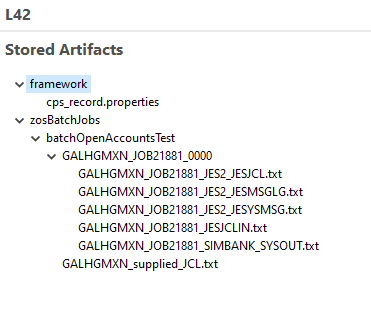

This test uses the z/OS Batch Manager (which in the background, invokes z/OSMF) to add a set of accounts to the Galasa SimBank system via a z/OS batch job.

When you installed the Galasa Eclipse plug-in, some of the configuration information you set in the `overrides.properties` file was specific to the z/OSMF and z/OS Batch Managers. Confirm that the file - it's located in your `.galasa` folder - contains, in its entirety:

```properties
zos.dse.tag.SIMBANK.imageid=SIMBANK
zos.dse.tag.SIMBANK.clusterid=SIMBANK

simbank.dse.instance.name=SIMBANK
simbank.instance.SIMBANK.zos.image=SIMBANK

zos.image.SIMBANK.ipv4.hostname=127.0.0.1
zos.image.SIMBANK.telnet.port=2023
zos.image.SIMBANK.telnet.tls=false
zos.image.SIMBANK.credentials=SIMBANK

zosmf.server.SIMBANK.images=SIMBANK
zosmf.server.SIMBANK.hostname=127.0.0.1
zosmf.server.SIMBANK.port=2040
zosmf.server.SIMBANK.https=false
```

For brevity, package declarations and imports are omitted in the following walkthrough.

## Walkthrough - BatchAccountsOpenTest

First, some Managers are declared, including a new Manager - `ZosBatch` and a related annotation and interface `ZosBatchJobname`.

```java
@ZosBatch(imageTag = "simbank")
public IZosBatch zosBatch;

@ZosBatchJobname(imageTag = "simbank")
public IZosBatchJobname zosBatchJobname;
```
Next, the `batchOpenAccountsTest()` method is specified. It starts off by assembling a `List<String>` of account Strings - each such String contains an account number, a sort code and an initial credit, separated by commas:

```java
// Create a list of accounts to create
List<String> accountList = new LinkedList<>();
accountList.add("901000001,20-40-60,1000");
accountList.add("901000002,20-40-60,1000");
accountList.add("901000003,20-40-60,1000");
accountList.add("901000004,20-40-60,1000");
accountList.add("901000005,20-40-60,1000");
accountList.add("901000006,20-40-60,1000");
accountList.add("901000007,20-40-60,1000");
accountList.add("901000008,20-40-60,1000");
accountList.add("901000009,20-40-60,1000");
```

A `HashMap` called `parameters` is instantiated, associating `ACCOUNT_OPEN` with the key `CONTROL`, and the concatenated list of accounts (each item terminated by `'\n'`) with the key `DATAIN`.

```java
// Create the substitution parameters for the JCL
HashMap<String, Object> parameters = new HashMap<>();
parameters.put("CONTROL", "ACCOUNT_OPEN");
parameters.put("DATAIN", String.join("\n", accountList));
```

The `HashMap` will eventually deposit its contents in the designated substitution variables (`++CONTROL++` and `++DATAIN++`) located in some skeletal JCL stored in `/src/main/resources/skeletons/SIMBANK.jcl`:

```
//SIMBANK  EXEC PGM=SIMBANK
//SYSOUT   DD SYSOUT=*
//CONTROL  DD *
++CONTROL++
//DATAIN   DD *
++DATAIN++
```
Loading the JCL with the parameters:
```java
// Load the JCL with the given substitution parameters
InputStream inputStream = resources.retrieveSkeletonFile("/resources/skeletons/SIMBANK.jcl", parameters);
String jcl = resources.streamAsString(inputStream);
```
At this stage, the String `jcl` contains:
```
//SIMBANK  EXEC PGM=SIMBANK
//SYSOUT   DD SYSOUT=*
//CONTROL  DD *
ACCOUNT_OPEN
//DATAIN   DD *
901000001,20-40-60,1000
901000002,20-40-60,1000
901000003,20-40-60,1000
901000004,20-40-60,1000
901000005,20-40-60,1000
901000006,20-40-60,1000
901000007,20-40-60,1000
901000008,20-40-60,1000
901000009,20-40-60,1000
```
The JCL is submitted and the program waits for the batch job to complete:
```java
// Submit the JCL
IZosBatchJob batchJob = zosBatch.submitJob(jcl, zosBatchJobname);

// Wait for the batch job to complete
logger.info("batchJob.toString() = " + batchJob.toString());
int rc = batchJob.waitForJob();
```
Finally, the return code is examined and if it is not 0, the test is failed:
```java
// If highest CC was not 0, fail the test
if (rc != 0) {
	// Print the job output to the run log
	batchJob.retrieveOutput().forEach(jobOutput -> logger.info(
			"batchJob.retrieveOutput(): " + jobOutput.getDdname() + "\n" + jobOutput.getRecords() + "\n"));
	Fail.fail("Batch job failed RETCODE=" + batchJob.getRetcode() + " Check batch job output");

}
logger.info("Batch job complete RETCODE=" + batchJob.getRetcode());
```
You can run this example just like the others - don't forget to launch SimBank first, and create a new run configuration.

By using the concepts introduced in this example, you can write your own z/OS Batch Manager tests.

The z/OS Batch Manager stores the job output in the test results main archive store.

## Reviewing the stored artifacts
When `BatchAccountsOpenTest` has finished running, you can expand the relevant entry in the *Galasa Results* tab - if it is not initially visible, choose *Galasa > Initialise Galasa Framework* and then *Window > Show View > Other* and finally, *Galasa Results*. 

For example, your *Galasa Results* tab might resemble:


Double-click on a run and you can explore the three tabs in the main pane:

* <b>General</b>: presenting some useful overview metrics about the run, and its payload of tests and test classes
* <b>Run Log</b>: which stores the console messages emitted by Eclipse as the test ran, which end with the following lines signifying test success:

```
****************************************************************************************************
*** Passed - Test method dev.galasa.simbanks.tests.BatchAccountsOpenTest#batchOpenAccountsTest,type=Test
****************************************************************************************************
28/01/2020 09:31:53.738 INFO dev.galasa.framework.TestClassWrapper.runTestMethods - Ending
****************************************************************************************************
*** Passed - Test class dev.galasa.simbanks.tests.BatchAccountsOpenTest
****************************************************************************************************

```

* <b>Stored Artifacts</b>: which contain a variety of detailed test-related outputs - the specifics are determined by the writer of the z/OS Batch Manager in this case.



The outputs include the constructed input JCL and several of the usual JES batch output datasets.

<details>
<summary>BatchAccountsOpenTest - full source listing</summary>

```java
package dev.galasa.simbanks.tests;

import java.io.IOException;
import java.io.InputStream;
import java.util.HashMap;
import java.util.LinkedList;
import java.util.List;

import org.apache.commons.logging.Log;
import org.assertj.core.api.Fail;

import dev.galasa.Test;
import dev.galasa.artifact.ArtifactManager;
import dev.galasa.artifact.IArtifactManager;
import dev.galasa.artifact.IBundleResources;
import dev.galasa.artifact.TestBundleResourceException;
import dev.galasa.core.manager.Logger;
import dev.galasa.zos.IZosImage;
import dev.galasa.zos.ZosImage;
import dev.galasa.zosbatch.IZosBatch;
import dev.galasa.zosbatch.IZosBatchJob;
import dev.galasa.zosbatch.IZosBatchJobname;
import dev.galasa.zosbatch.ZosBatch;
import dev.galasa.zosbatch.ZosBatchException;
import dev.galasa.zosbatch.ZosBatchJobname;

@Test
public class BatchAccountsOpenTest {

	@ZosImage(imageTag = "simbank")
	public IZosImage image;

	@ZosBatch(imageTag = "simbank")
	public IZosBatch zosBatch;

	@ZosBatchJobname(imageTag = "simbank")
	public IZosBatchJobname zosBatchJobname;

	@ArtifactManager
	public IArtifactManager artifacts;

	@Logger
	public Log logger;

	/**
	 * Test which uses the SIMBANK batch job to open a number of new accounts. The
	 * test passes if the job completes successfully (RC=0000)
	 * 
	 * @throws TestBundleResourceException
	 * @throws IOException
	 * @throws ZosBatchException
	 */
	@Test
	public void batchOpenAccountsTest() throws TestBundleResourceException, IOException, ZosBatchException {
		// Create a list of accounts to create
		List<String> accountList = new LinkedList<>();
		accountList.add("901000001,20-40-60,1000");
		accountList.add("901000002,20-40-60,1000");
		accountList.add("901000003,20-40-60,1000");
		accountList.add("901000004,20-40-60,1000");
		accountList.add("901000005,20-40-60,1000");
		accountList.add("901000006,20-40-60,1000");
		accountList.add("901000007,20-40-60,1000");
		accountList.add("901000008,20-40-60,1000");
		accountList.add("901000009,20-40-60,1000");

		// Create the substitution parameters for the JCL
		HashMap<String, Object> parameters = new HashMap<>();
		parameters.put("CONTROL", "ACCOUNT_OPEN");
		parameters.put("DATAIN", String.join("\n", accountList));

		// Load the JCL with the given substitution parameters
		IBundleResources resources = artifacts.getBundleResources(this.getClass());
		InputStream inputStream = resources.retrieveSkeletonFile("/resources/skeletons/SIMBANK.jcl", parameters);
		String jcl = resources.streamAsString(inputStream);

		// Submit the JCL
		IZosBatchJob batchJob = zosBatch.submitJob(jcl, zosBatchJobname);

		// Wait for the batch job to complete
		logger.info("batchJob.toString() = " + batchJob.toString());
		int rc = batchJob.waitForJob();

		// If highest CC was not 0, fail the test
		if (rc != 0) {
			// Print the job output to the run log
			batchJob.retrieveOutput().forEach(jobOutput -> logger.info(
					"batchJob.retrieveOutput(): " + jobOutput.getDdname() + "\n" + jobOutput.getRecords() + "\n"));
			Fail.fail("Batch job failed RETCODE=" + batchJob.getRetcode() + " Check batch job output");

		}
		logger.info("Batch job complete RETCODE=" + batchJob.getRetcode());
	}
}

```
</details>
