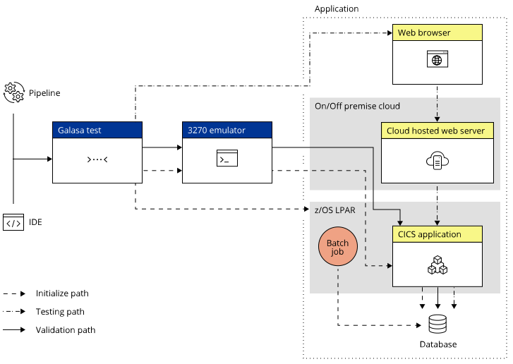

The `WebAppIntetgrationTest` is somewhat different to the previously described Galasa SimBank tests as it shows how you can use Galasa to test a hybrid cloud application that uses a mix of platforms and technologies. A mix of technologies makes end-to-end integration testing complicated. Use the `WebAppIntetgrationTest` to help understand how Galasa simplifies integration testing in such an environment.

The `WebAppIntetgrationTest` test demonstrates the end-to-end integration testing of an application that runs on different platforms (z/OS and Cloud) and uses different technologies (a 3270 emulator, JCL batch job and Selenium Web Driver).

The following diagram shows how you can use the WebAppIntegrationTest to test a hybrid cloud application: 



The diagram highlights the use of the following technology, and the interaction between the test and those technologies.

 - The 3270 emulator creates a random account number and checks that it does not exist in the CICS region
 - If the account does not exist the account is created by the Z/OS Batch Manager and is inserted into the backend database
 - Docker then generates a web page
 -  Selenium drives the web browser to complete a web form and confirm the balance of the account


## Running the WebAppIntegrationTest

As the `WebAppIntetgrationTest` is slightly different to the other tests, there's a bit more set up to do than for the other supplied SimBank tests. 

The test is still run locally but is designed to help you to understand how to set the properties to enable the test to run in a Galasa Ecosystem. When running locally, you can use the localhost setting `127.0.0.1` for increased security. 

The test uses the Selenium Manager, which in turn is dependent on the Docker Manager. Use the following sections to help you to understand how to configure your environment to work with the Selenium and Docker Manager. 

### Using the Selenium Manager

The `WebAppIntetgrationTest` uses the Selenium Manager. To use the Selenium Manager you must have a web browser, for example, Chrome or Firefox installed as well as either a gecko driver or a docker engine. In this example, Firefox and a gecko driver are used. 

You can <a href="https://github.com/mozilla/geckodriver/releases" target="_blank"> download Gecko driver from GitHub</a>. 

You must define the default and local driver properties in the CPS, as shown in the following example:

```
selenium.default.driver=FIREFOX
selenium.local.driver.FIREFOX.path=<path/to/geckodriver>
```

### Using the Docker Manager 

The Selenium Manager has a dependency on the Docker Manager in order to run. Some set up is required for the Docker Manager in the CPS properties file. To configure the Docker Manager, set the following CPS properties:  

```
docker.dse.engine.PRIMARY=LOCAL
docker.default.engines=LOCAL
docker.engine.LOCAL.hostname=127.0.0.1
docker.engine.local.port=2375
docker.engine.local.max.slots=10
docker.container.TAG.name=simbank-webapp
```

These properties allow local test runs to access the local Docker Engine when the TCP port of the local Docker Engine is enabled.


After updating the CPS properties, run the following terminal commands to open a TCP socket for accessing the Dokcer API:

```
docker pull alpine/socat
docker run -d -p 127.0.0.1:2376:2375 -v /var/run/docker.sock:/var/run/docker.sock alpine/socat tcp-listen:2375,fork,reuseaddr unix-connect:/var/run/docker.sock
```

Test that the container is working correctly by running the following command:

```
mvn install
docker image build -t simbank-webapp .
docker run -p 8080:8080 -d simbank-webapp
```

### Troubleshooting

If the container is not working correctly, for example, compilation and runtime errors are returned, check the version of tomcat in the Dockerfile. You might need to edit the tomcat version to a version that is compatible with Java 11, for example, ```FROM tomcat:8.5.82-jre11-temurin```.


### About the WebAppIntetgrationTest

To run the test, follow the same steps as for `SimBankIVT.java` but using the test class name `WebAppIntetgrationTest` instead of `SimBankIVT`. Don't forget that you need to launch [Galasa SimBank](/docs/getting-started/simbank) before running the test.

This test performs a similar function to the `ProvisionedAccountCreditTest.java` but includes the use of the Selenium Manager. The Selenium Manager enables the test to run Selenium WebDrivers which drive the SimBank Web Application that is provided with Galasa SimBank. 

The `WebAppIntetgrationTest` generates a unique account number to use in the test and provisions the account with a randomly generated opening balance by using a 3270 emulator that connects to the web application which opens in Firefox. A batch job opens the account and fills in a form to credit the account with the opening balance. The 3270 emulator then connects to the web application, searches for the account number and retrieves the balance.  


## Walkthrough - WebAppIntegrationTest

For brevity, package declarations and imports are omitted in the following walkthrough.

First, some Managers are declared, including a new Manager - `seleniumManager` - and a related annotation and interface `resources`.

```java
@SeleniumManager
public ISeleniumManager seleniumManager;
@BundleResources
public IBundleResources resources;
```

Next, the `provisionAccount()` method is specified: 

```java
String accountNumber = provisionAccount(openingBalance);
logger.info("Account number selected: " + accountNumber);
```

The `provisionAccount()` method generates a new random account number to use in the test, using a 3270 SimBank terminal to interact with the SimBank web application to ensure that the generated account does not already exist:

```java
public String provisionAccount(BigDecimal openingBalance) throws Exception {
		// Generate a random account number
		String accountNumber =  generateRandomAccountNumber();
		boolean searching = true;
		
		// A looped search to ensure the account number is unique.
		while (searching) {
			if (doesAccountExist(accountNumber)) {
				accountNumber =  generateRandomAccountNumber();
			} else {
				searching = false;
			}
		}
```

The account is opened and credited by using a z/OS Batch Job. When the amount to be credited is set, a HashMap is prepared with the parameters for the subsequent web services call:

```java
HashMap<String, Object> parameters = new HashMap<>();
parameters.put("CONTROL", "ACCOUNT_OPEN");
parameters.put("DATAIN", accountNumber+",20-24-09,"+openingBalance);
```

The following code enables Selenium WebDrivers to use a web browser to interact with and submit a form inside the provisioned weplication:

```java
IWebPage page = completeWebFormAndSubmit(accountNumber, creditAmount.toString());
logger.info("Web form submitted");
```

Checks are made to ensure that the web app response is as expected and that the data is updated throughout the application, including the backend database:

```java
assertThat(page.waitForElementById("good").getText()).contains("You have successfully completed the transaction");
page.quit();
logger.info("Response from servlet OK. Now validating the data has been updated in the database");
BigDecimal balance = retrieveAccountBalance(accountNumber).setScale(2);
assertThat(balance).isEqualTo(openingBalance.add(creditAmount));
logger.info("Test method complete");
```

At the end of the test, the Selenium Manager automatically closes the WebDriver which removes the web page.


