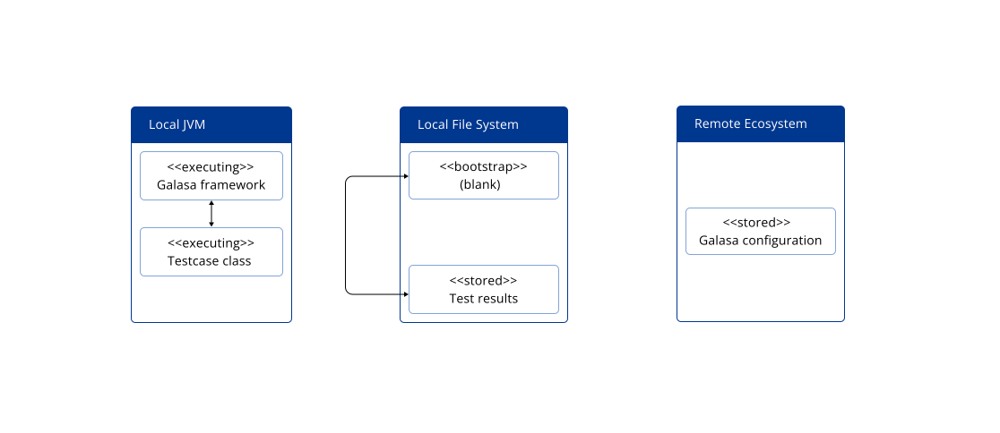

You can choose to run your Galasa test in the following ways: 

- Locally, with everything running on the local machine
- Locally, but using a shared configuration that is  hosted by a Galasa Ecosystem
- Remotely, by submitting the test to run in a Galasa Ecosystem 

The following sections explain the concepts behind the ways of running Galasa tests and the benefits and limitations of each option.


## Running a test locally

When you run a test locally, without using shared configuration, everything runs on your local machine. The Galasa bootstrap file is blank and makes no reference to an Ecosystem. The Galasa framework is launched within the JVM on the local machine and the local file system holds all the configuration that is used by the test. The test runs in the local JVM and all test results and artifacts are stored on the local disk. 

You can run a test in this mode by using the following command:
```
galasactl runs submit --local … <more options are needed>
```
or by using the Eclipse plugin, in which case the test is hosted within the Eclipse JVM.


## Running a test locally but using shared configuration

When you run a test locally, but using shared configuration, the Galasa bootstrap file refers to the Ecosystem that you want to use. The Galasa framework is launched within the JVM on the local machine, but the framework consults the remote ecosystem to read configuration data. This is the key difference between running a test locally without using shared configuration. The test still runs in the local JVM and all test results and artifacts are stored on the local disk. 

You can run a test in this mode by setting up your bootstrap to refer to the Ecosystem that you want to use and running the following command:
```
galasactl runs submit --local … <more options are needed>
```
or by using the Eclipse plugin, in which case the test is hosted within the Eclipse JVM.




## Running a test remotely in a Galasa Ecosystem


When you run a test remotely, the Galasa bootstrap file refers to the Ecosystem that you want to use, and the test is run on the specified remote Galasa Ecosystem.  The configuration for the test is also held within that Ecosystem and Galasa starts up on contain in which the test code runs. The test results and artifacts are store in a database within the Ecosystem and authorised users on client machines are able to view the test results. 

The Galasa framework is launched within the JVM on the local machine, but the framework consults the remote ecosystem to read configuration data. This is the key difference between running a test locally without using shared configuration. The test still runs in the local JVM and all test results and artifacts are stored on the local disk. 

You can run a test in this mode by setting up your bootstrap file to refer to the Ecosystem that you want to use and running the following command to schedule a test to run in the Ecosystem:
```
galasactl runs submit …
```

Rename Ecosystem Architecture > The Galasa Ecosystem and put in some blurb at the front of the topic and then do the the Ecosystem Architecture underneath as a sub heading (just use the para under the first image at the top)


