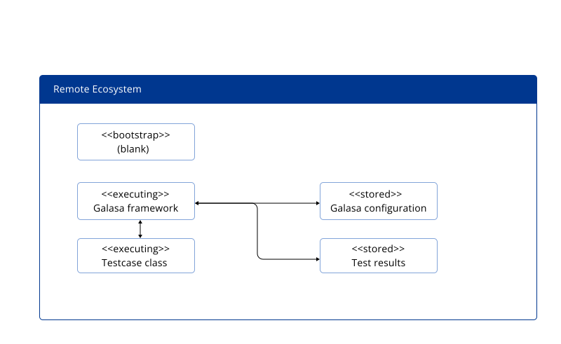

There are three modes in which you can run a Galasa test. You can run a test locally, with everything running on the local machine. You can run a test locally but using a shared configuration that is hosted by the Galasa ecosystem. Or, you can run a test remotely by submitting the test to run in the Galasa ecosystem. 


The mode in which you choose to run a test depends on what you are trying to achieve with the test run. Use the following information to understand the concepts behind running Galasa tests in each of these modes, and when running a test in that mode is most appropriate. Further information on the advantages and disadvantages of these modes can be found in the <a href=https://galasa.dev/docs/ecosystem> The Galasa Ecosystem</a> documentation. 


## Running a test locally


When you run a test locally, without using shared configuration, everything runs on your local machine. The Galasa bootstrap file is blank and makes no reference to an ecosystem. The Galasa framework is launched within the JVM on the local machine and the local file system holds all the configuration that is used by the test. The test runs in the local JVM and all test results and artifacts are stored on the local disk. 


You can run a test in this mode by using the following command:

```
galasactl runs submit --local … <more options are needed>
```

or by using the Eclipse plugin, in which case the test is hosted within the Eclipse JVM.


## Running a test locally but using shared configuration

When you run a test locally, but using shared configuration, the Galasa bootstrap file refers to the Galasa Ecosystem that you want to use. The Galasa framework is launched within the JVM on the local machine, but the framework consults the remote ecosystem to read configuration data. This is the key difference between running a test locally without using shared configuration. The test still runs in the local JVM and all test results and artifacts are stored on the local disk. 


You can run a test in this mode by setting up your bootstrap to refer to the ecosystem that you want to use and running the following command:

```
galasactl runs submit --local 
```

or by using the Eclipse plugin, in which case the test is hosted within the Eclipse JVM.


### When to run a test locally

Running a test locally is useful when you are doing the following types of task:

- Developing tests, and running those tests against a non-production environment.

- Running ad-hoc tests against a development or non-production target system.

- Running many tests in series against a target system which can withstand the load that is placed on it.

- Running tests against a target system which is dynamically provisioned, used exclusively by the tests, and de-provisioned afterwards.

- Running tests within a JVM that will not be interrupted, or halted mid-flow, causing a build-up of allocated resources in the system under test.

- When there is time to find and share test run logs and artifacts with bug investigators, whenever a test fails and finds a bug.


## Running a test remotely in a Galasa Ecosystem

When you run a test remotely, the Galasa bootstrap file refers to the Galasa Ecosystem that you want to use, and the test is run on the specified remote ecosystem.  The configuration for the test is also held within that ecosystem, and Galasa starts up on the container in which the test code is running. The test results and artifacts are stored in a database within the ecosystem and authorised users on client machines are able to view the test results. 

The Galasa framework is launched within the JVM on the local machine, but the framework consults the remote ecosystem to read configuration data. This is the key difference between running a test locally without using shared configuration. The test still runs in the local JVM and all test results and artifacts are stored on the local disk. 



You can run a test in this mode by setting up your bootstrap file to refer to the ecosystem that you want to use and running the following command to schedule a test to run in the ecosystem:

```
galasactl runs submit
```


### When to run a test remotely

Running a test remotely is useful in the following scenarios:

- Tests need to run in parallel in an environment where resources are limited and need to be managed between tests. For example, ports, slots of processing capability, files, and sessions.

- Tests need to run in parallel in the shortest timeframe. 

- Test results and reports need gathering from a single point. For example, when test results need reporting or exporting to another report-generating system.

- When the clean-up of resources in the system under test is an important requirement.

- When bug investigation can proceed by independent inspection test results and artifacts.


