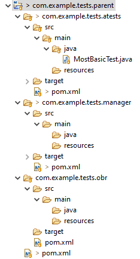

You can quickly and easily create a project structure to accommodate your own independent tests in your local storage by using the [Galasa command line interface](/docs/cli-command-reference/cli-command-reference) (Galasa CLI) that is provided with Galasa. 

You can pass parameters to the Galasa CLI `project create` command, enabling you to choose your own artifact names and naming conventions. Artifacts are created on disk and can later be built, tested and deployed to a Maven repository and used in the Galasa Ecosystem. Generated artifacts can be embellished and refactored to form the basis of future Galasa tests.

## A bit about Maven

<a href="http://maven.apache.org" target="_blank">Maven</a> is an Open Source build automation tool, initially created in 2003 and part of the Apache Software Foundation. You do not explicitly need to install it, the Galasa plugin downloads and installs it silently during its own installation and configuration. If you have already installed Maven as part of some other software project, no action is needed.

Maven is _opinionated_, which means that you need to comply with its expectations about how a project and its directories should be organised. When you create a Maven project, you should use the generated structure.

The most visible practical evidence that a project is a Maven project is its pervasive use of `pom.xml` (Project Object Model) files. These XML files contain the magic that allows Maven to manage your project dependencies and build orchestration. 

## Before you start

First, check that you can run one or more of the tests in an example project. Don't rush this - it is recommended that you familiarise yourself with all of the Galasa examples before creating your own project. But as a minimum, if you can run <a href="/docs/running-simbank-tests/simbank-IVT" target="_blank">The SimBank IVT</a> test, you are all set.

Check that an `.m2` folder exists in your user home directory. Built artifacts are placed in the `~/.m2/repository`. On Windows, the user home directory resembles: C:\Users\<username>, on MacOS it will be /Users/<username> and on Linux /home/<username>. Note that any file or folder beginning with a . is a hidden folder, so you might need to change the settings on your operating system to show hidden files.

## A little plan

A full (parent) Galasa project includes several sub-projects, which can also be known as _modules_, some of which are mandatory and some optional. A parent project can contain the following sub-projects:

- A Managers sub-project, allowing you to extend the provided range of Managers. In practice, if you have no intention of writing a Manager, you can omit this.
- An OBR (OSGi Bundle Repository) sub-project, which is mandatory. Galasa uses the OBR to locate your test project(s) and reason about their interdependencies.
- One or more test sub-projects, that as the name implies, contain the tests themselves. 

The parent project establishes all the dependencies for the sub-projects or modules. It builds all the modules in the order of the dependencies - it builds the Manager module before the test projects that use it.

For simplicity, it is assumed that you will only have one version of a test in production at any one time. However, by establishing different versions of your tests, you can have test streams with different versions of the same test project. For the purposes of the forthcoming example, the version of all projects is set to `0.1.0-SNAPSHOT`. 


## Creating an example test project

In the following example we are going to use the Galasa CLI to build a hierarchy of projects, where the parent project _dev.galasa.example.banking_ contains the following modules: 
- Two test sub-projects or modules called _dev.galasa.example.banking.payee_ and _dev.galasa.example.banking.account_ 
- A mandatory OBR sub-project called _dev.galasa.example.banking.obr_.

This setup is designed as an example of how to create a project structure that might ultimately be deployed to a Maven repository, so that your Galasa automation system can find everything it needs to run.

The following syntax examples assume a banking application is being tested. The banking application contains functionality that deals with `payee` and `account` object types, both of which can be manipulated.

On Mac or Unix:

```
galasactl project create \
        --package dev.galasa.example.banking \
      	--features payee,account \
   		--force \
		--obr \
		--log -
```


On Windows (Powershell):

```
galasactl project create ^
        --package dev.galasa.example.banking ^
      	--features payee,account ^
   		--force ^
		--obr ^
		--log -
```

where <br>
- ```--package``` is the name of a Java package. This parameter is mandatory. Use the provided example to help you to understand how you might create unique names for your Java test packages. Sections can reflect your company, organisation, the application under test, or any other name-spacing of your choice. The value chosen influences the names of the folders, OSGi bundles, Maven coordinates, and the eventual Java package name in which example tests are created. The name must be all lower-case letters and numbers (`a-z`, `0-9`), with `.` (period) character separators. No part of the name can clash with a Java language reserved word. <br>
- ```--features``` is a comma-separated list of one or more features of the application that you want to test. This parameter is optional, defaulting to `test`. The entries in this list influence the names of some folders, OSGi bundles, Maven coordinates and Java class names of the generated example tests. In the example provided, the banking application under test has a `payee` section and an `account` section which need testing. Creating subcomponents of your test suite to test these features or components of the application creates a naming structure in which your tests can be organised. These names must be lower-case letters and numbers (`a-z`, `0-9`), with no `.` (period) or special characters. No part of the name can clash with a Java language reserved word. <br>
- ```--force``` is an optional flag. If the flag is missing, then any file that the Galasa CLI tool tries to create which already exists causes a failure, and the original file is preserved. If this flag is used, then such files are silently over-written. Use this option carefully to avoid some of your files being over-written, resulting in the loss of some of your data.
- ```--obr``` Creates an OBR project. For tests to run in the ecosystem they require compiled artifacts to be hosted in a Maven repository. The artifacts must be bundled as an OSGI bundle. Creating an OBR project makes it easier to move from running a test locally to running that test in an ecosystem.
- ```--log -``` sends the trace and logging output that is generated by the tool to the console.

## Building the example project using Maven

Run the following commands to navigate to the parent folder (in this example the _dev.galasa.example.banking_ directory) invoke Maven to build the OSGi bundles:

```
cd dev.galasa.example.banking
mvn clean install
```

The built artifacts are typically placed in the `~/.m2/repository` in your home directory.

Note: The tool currently does not generate build files for use with Gradle.


## Understanding the generated artifacts

Running the example Galasa CLI `project create` command creates a number of files in the following standard folder structure:

```
────dev.galasa.example.banking
    ├───dev.galasa.example.banking.account
    │   └─── pom.xml
    │   └───src
    │       └───main
    │           ├───java
	│			│ 	└───dev
	│			│		└───galasa
	│			│			└───example
	│			│				└───banking
    │           │ 					└───account
	│			│						└───TestAccount.java
	│			│						└───TestAccountExtended.java
	│			│  
    │           └───resources
	│				└───textfiles
	│					└───sampleText.txt	
	│───dev.galasa.example.banking.obr
    │   └─── pom.xml
    ├───dev.galasa.example.banking.payee
    │	└─── pom.xml
    │   └───src
    │       └───main
    │           ├───java
	│			│	└───dev
	│			│		└───galasa
	│			│			└───example
	│			│				└───banking
	│			│					└───TestPayee.java
	│			│					└───TestPayeeExtended.java
    │           └───resources
	│				└───textfiles
	│					└───sampleText.txt
    └─── pom.xml
```


The names of the root folders are not part of Maven's opinionated stance (they were just chosen for this exercise - but there is a conventional pattern to follow), however, the names of the lower level folders (`src`, `main`, `java` and so on) most certainly are.

As well as a hierarchy of directories, there are four `pom.xml` files placed at specific locations:

- _dev.galasa.example.banking_
- _dev.galasa.example.banking.account_
- _dev.galasa.example.banking.obr_
- _dev.galasa.example.banking.payee_

Of course, the four _pom.xml_ files all have different contents!

## Importing the example test project into your IDE

Complete the following steps to import an example test project into Eclipse:

1. Launch Eclipse and choose _File > Import..._
1. In the _Select_ dialog, expand _Maven_, choose _Existing Maven Projects_ and click _Next_.
1. Navigate to your root project directory - _dev.galasa.example.banking_ in this case - and follow the remaining prompts to complete the import. If you see a warning or error dialog, opt to resolve the error later.
1. View your set of projects in _Package Explorer_.


## More about the parent project

The top level folder, which is called `dev.galasa.example.banking` in this example, is the parent project. The parent project is a convenient container in which to hold all of the generated files. The `pom.xml` in the parent project is used to build all the other generated files.

Within the example parent project structure there are three generated OSGi bundle sub-projects:

- The payee bundle project, _dev.galasa.example.banking.payee_, which contains two Galasa tests - _TestPayee.java_ and _TestPayeeExtended.java_ - both of which relate to testing the `payee` feature.
- The account test bundle project, _dev.galasa.example.banking.account_, which contains two Galasa tests - _TestAccount.java_ and _TestAccountExtended.java_ - both of which relate to testing the `account` feature.

- An OSGi Bundle Repository <a href="https://felix.apache.org/documentation/subprojects/apache-felix-osgi-bundle-repository.html" target="_blank">(OBR)</a> which holds metadata listing the tests that are available in the Galasa test projects.


## More about the test projects

Within each of the Galasa test projects  - `payee` and `account` - you can see the following files and folders:

- A pom.xml file (for use by the Maven build tool)

- A `src` tree holding source code

- Two java files in each `feature` test project

- A text resource file in each `feature` test project, which is read and used by the tests at run-time.


## About the tests

The _TestAccount.java_ and the _TestPayee.java_ source files show how a Core Manager can be injected into your test class before any test methods being used. 

The _TestAccountExtended.java_ and the _TestPayeeExtended.java_ source files show:

- How to obtain the `run-id` identifier by which an instance of running the test can be known. This can be useful for naming artifacts, logging or otherwise.

- How to read a text file resource which is embedded within the test OSGi bundle. This can be useful for getting data files for use in the testing of the application.

- How logging can be performed to help debug issues in the test code itself.

- How a file that is created by the test run can be captured together with other test results for later viewing.

You can find the templates that generate these Java files in the <a href="https://github.com/galasa-dev/cli" target="_blank">Galasa cli repository</a>.


## Additional notes on the key elements of pom.xml files

The following sections provide a little more information about some of the elements that are found within the various pom.xml files.

### The parent pom.xml file elements

- The `<project>` and `<modelVersion>` elements are standard prologues to a `pom.xml` file.

The following extract from the generated parent pom.xml shows some of the key elements that are described:

```
<groupId>dev.galasa.example.banking</groupId>
<artifactId>dev.galasa.example.banking</artifactId>
<version>0.0.1-SNAPSHOT</version>	
<packaging>pom</packaging>
```

- The `<groupId>` is used to group related Maven projects in a Maven repository. It is recommended (but not enforced) that all projects in a [test stream](../writing-own-tests/test-streams) share the same `groupId`.
- The `<artifactId>` must be unique for each Maven project under a `groupId`. To prevent confusion, you could make it unique across `groupId`s. The `groupId` and `artifactId` can nominally be anything you choose, but if you were to ever consider publishing the project on Maven Central, you would have to ensure that they were unique across Maven Central. Because of this, and to avoid future name collisions, it is conventional to use (reversed) company domain names, which leads to patterns like `dev.galasa.example.banking`.
- The `<version>` in this project is set to `0.1.0-SNAPSHOT`. 
- `<packaging>` indicates what type of Maven project this is - in this case, a `pom` project.

The following extract from the parent pom.xml shows the module elements that are contained within the generated parent pom.xml:

```
<modules>
	<module>dev.galasa.example.banking.payee</module>
	<module>dev.galasa.example.banking.account</module>
	<module>dev.galasa.example.banking.obr</module>
</modules>
```	

- `<modules>` details what sub-modules (sub-projects) are contained within this parent project. Usually, when the parent project is built, so are the sub-modules.

Other elements that are contained within the generated parent pom.xml are listed in the following section: 

- `<distributionManagement>` controls where Maven deploys the project when built. A variable is used so that the same project can be built and deployed to different test stream repositories.
- The `<properties>` element specifies properties such as file encoding and Java version numbers. 
- `<dependencyManagement>` establishes the versions of dependencies in all of the sub-modules. A BOM project is provided by the Galasa team that includes the versions of all of the released Managers. Set the version of Galasa you wish to run against, for example 0.20.0, and all the Manager versions are imported.
- `<dependencies>` list all the Managers you wish to make available for your tests and custom Manager if present. You could include `<dependencies>` in each of the sub-modules, but it is easier to maintain the list here.
- `<plugins>` identify the Maven plugins to be used during the build process. The `maven-bundle-plugin` builds OSGi bundles (the Manager and test projects), indicated by `<packaging>bundle</packaging>`. The `galasa-maven-plugin` is used in two ways - to build a test catalog for each bundle project and to build the `<packaging>galasa-obr</packaging>` project.

### The test project pom.xml file elements

- The `<parent>` element signifies that all the properties and dependencies found in the parent pom.xml file are to be used for this project - avoiding duplication and allowing changes to ripple through all sub-projects.
- The `<packaging>` element is set to `bundle` so an OSGi bundle is built instead of a simple JAR.


### The test pom.xml file elements

<<<<<<< HEAD
- The `<packaging>` element is set to `galasa-obr` which causes the Galasa Maven plugin to build this project.
=======
If you have followed through on any of the provided SimBank tests, you will have no problem understanding what's going on in this example!

</details>

<details>
<summary>
<code>com.example.tests.parent/com.example.tests.atests/pom.xml</code>
</summary>

```XML
<project xmlns="http://maven.apache.org/POM/4.0.0" xmlns:xsi="http://www.w3.org/2001/XMLSchema-instance" xsi:schemaLocation="http://maven.apache.org/POM/4.0.0 http://maven.apache.org/xsd/maven-4.0.0.xsd">
    <modelVersion>4.0.0</modelVersion>

    <parent>
        <groupId>com.example.tests</groupId>
        <artifactId>com.example.tests.parent</artifactId>
        <version>0.1.0-SNAPSHOT</version>
    </parent>

    <artifactId>com.example.tests.atests</artifactId>
    <packaging>bundle</packaging>

    <dependencies>
        <dependency>
            <groupId>com.example.tests</groupId>
            <artifactId>com.example.tests.manager</artifactId>
            <version>0.1.0-SNAPSHOT</version>
        <scope>provided</scope>
        </dependency>
    </dependencies>
</project>
```

- Pointing to the `<parent>` means that its dependencies and properties are reused in this project.
- `<packaging>` is an OSGi bundle.
- As a dependency cannot be included in the parent for a custom Manager, if present, it needs to be included here. Maven will ensure that the Manager is built before the test projects.

</details>

<details>
<summary>
<code>com.example.tests.parent/com.example.tests.manager/pom.xml</code>
</summary>

```xml
<project xmlns="http://maven.apache.org/POM/4.0.0"
	xmlns:xsi="http://www.w3.org/2001/XMLSchema-instance"
	xsi:schemaLocation="http://maven.apache.org/POM/4.0.0 http://maven.apache.org/xsd/maven-4.0.0.xsd">
	<modelVersion>4.0.0</modelVersion>
	<parent>
		<groupId>com.example.tests</groupId>
		<artifactId>com.example.tests.parent</artifactId>
		<version>0.1.0-SNAPSHOT</version>
	</parent>
	<artifactId>com.example.tests.manager</artifactId>
	<packaging>bundle</packaging>
	<dependencies>
		<dependency>
			<groupId>dev.galasa</groupId>
			<artifactId>dev.galasa</artifactId>
			<scope>provided</scope>
		</dependency>
		<dependency>
			<groupId>dev.galasa</groupId>
			<artifactId>dev.galasa.framework</artifactId>
			<scope>provided</scope>
		</dependency>
		<dependency>
			<groupId>org.osgi</groupId>
			<artifactId>org.osgi.service.component.annotations</artifactId>
		</dependency>
	</dependencies>
</project>
```

- The `<parent>` element signifies that all the properties and dependencies found in the parent `pom.xml` file are to be used for this project - avoiding duplication and allowing changes to ripple through all sub-projects.
- `<groupId>` and `<version>` have not been provided - they will ripple down from the parent.
- `<packaging>` is `bundle` so an OSGi bundle is built instead of a simple JAR.
- Extra `<dependencies>` are included that are not relevant to the test projects. These are the `framework` and OSGi annotations, which are needed if/when developing Managers.

</details>

<details>
<summary>
<code>com.example.tests.parent/com.example.tests.obr/pom.xml</code>
</summary>

```xml
<project xmlns="http://maven.apache.org/POM/4.0.0" xmlns:xsi="http://www.w3.org/2001/XMLSchema-instance" xsi:schemaLocation="http://maven.apache.org/POM/4.0.0 http://maven.apache.org/xsd/maven-4.0.0.xsd">
    <modelVersion>4.0.0</modelVersion>
    <parent>
        <groupId>com.example.tests</groupId>
        <artifactId>com.example.tests.parent</artifactId>
        <version>0.1.0-SNAPSHOT</version>
    </parent>
    <artifactId>com.example.tests.obr</artifactId>
    <packaging>galasa-obr</packaging>
    <dependencies>
        <dependency>
            <groupId>com.example.tests</groupId>
            <artifactId>com.example.tests.manager</artifactId>
            <version>0.1.0-SNAPSHOT</version>
            <scope>compile</scope>
        </dependency>
        <dependency>
            <groupId>com.example.tests</groupId>
            <artifactId>com.example.tests.atests</artifactId>
            <version>0.1.0-SNAPSHOT</version>
            <scope>compile</scope>
        </dependency>
    </dependencies>
</project>
```

- `<packaging>` is set to `galasa-obr` which causes the Galasa Maven plugin to build this project.
- Any custom Manager and test projects need to be included so that an OBR and test catalog is built after examination of the contents of these projects.

</details>

## Importing the prepared directory into Eclipse

Launch Eclipse and choose _File > Import..._

In the _Select_ dialog, expand _Maven_, choose _Existing Maven Projects_ and click _Next_.

Navigate to your root project directory - _com.example.tests.parent_ in this case - and follow the remaining prompts to complete the import. If you see a warning or error dialog, opt to resolve the error later.

When viewed in the _Package Explorer_ your set of projects should resemble (your project won't yet have those _target_ folders - they indicate that the project has been built at least once):



To build the project with Java version 11, choose _Run > Run Configurations_ from the main menu. Create a Maven build from the _Main_ tab of the _Create, manage, and run configurations_ dialog and wait for the build process to complete.

From _Run > Run Configurations_, click _Galasa_ (not Galasa SimBank) and configure a new run configuration (call it MostBasicTest). Specify `com.example.tests.atests` for the project, and `MostBasicTest` for the test class. Press _Apply_ and then _Run_. The new run configuration executes and a familiar set of Galasa messages appears in the Eclipse console as the test runs to successful completion.
>>>>>>> main
